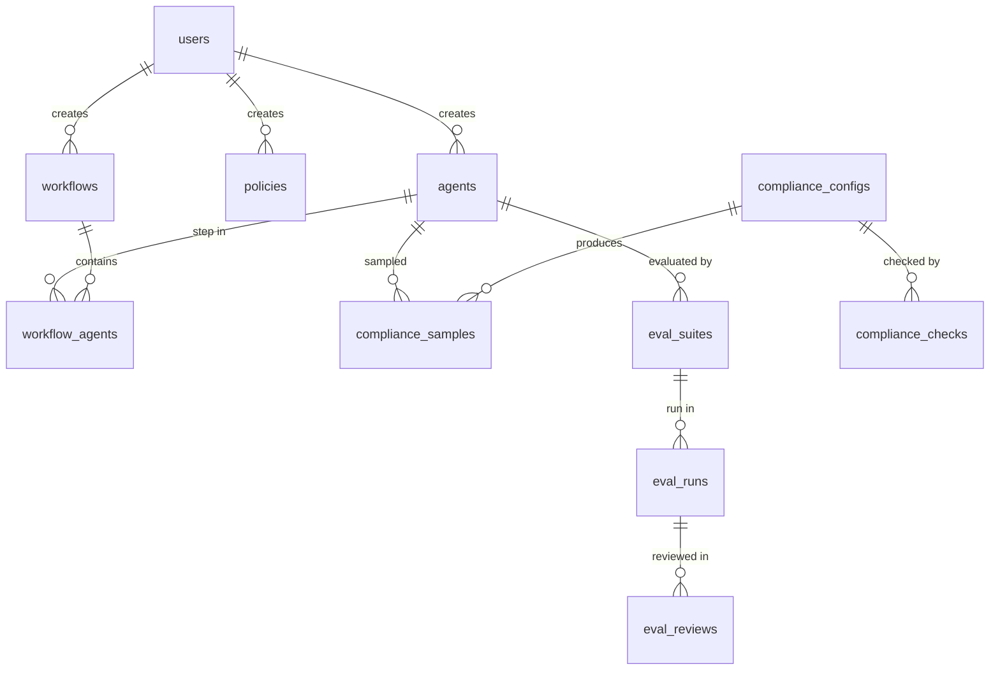

# AgentShield Database Schema

AgentShield uses PostgreSQL with 14 tables across 5 migrations. All primary keys are UUIDs (except `audit_log` which uses `BIGSERIAL`).

## Entity Relationship Diagram



---

## Core Tables (Migration 001)

### `users`

| Column | Type | Description |
|--------|------|-------------|
| `id` | UUID PK | Primary key |
| `email` | VARCHAR(255) UNIQUE | Login email |
| `password_hash` | TEXT | bcrypt-hashed password |
| `name` | VARCHAR(255) | Display name |
| `role` | VARCHAR(20) | `super_admin`, `admin`, `editor`, `viewer` |
| `department` | VARCHAR(255) | Department for policy matching |
| `is_active` | BOOLEAN | Account active status |
| `last_login_at` | TIMESTAMPTZ | Last login timestamp |
| `created_at` | TIMESTAMPTZ | Account creation time |

### `agents`

| Column | Type | Description |
|--------|------|-------------|
| `id` | UUID PK | Primary key |
| `name` | VARCHAR(255) | Agent display name |
| `slug` | VARCHAR(255) UNIQUE | URL-safe identifier |
| `type` | VARCHAR(20) | `external` or `internal` |
| `vendor` | VARCHAR(255) | Vendor name (e.g., OpenAI, Anthropic) |
| `protocol` | VARCHAR(20) | `a2a`, `mcp`, `rest`, `grpc` |
| `endpoint_url` | TEXT | Upstream agent URL |
| `auth_config` | JSONB | How to authenticate with this agent |
| `capabilities` | JSONB | Agent card metadata |
| `health_status` | VARCHAR(20) | `healthy`, `degraded`, `unhealthy`, `unknown` |
| `health_check_url` | TEXT | Optional health check endpoint |
| `version` | VARCHAR(50) | Agent version |
| `is_active` | BOOLEAN | Active/inactive status |
| `metadata` | JSONB | Additional metadata |
| `created_by` | UUID FK → users | Creator |
| `created_at` / `updated_at` | TIMESTAMPTZ | Timestamps |

### `workflows`

| Column | Type | Description |
|--------|------|-------------|
| `id` | UUID PK | Primary key |
| `name` / `slug` | VARCHAR(255) | Name and unique slug |
| `description` | TEXT | Workflow description |
| `is_enabled` | BOOLEAN | Enable/disable toggle |
| `max_concurrent` | INT | Maximum concurrent runs (default: 10) |
| `daily_limit` | INT | Max daily executions |
| `requires_approval` | BOOLEAN | Human-in-the-loop gate |
| `metadata` | JSONB | Additional metadata |

### `workflow_agents`

| Column | Type | Description |
|--------|------|-------------|
| `workflow_id` | UUID FK → workflows | Parent workflow |
| `agent_id` | UUID FK → agents | Agent in this step |
| `step_order` | INT | Execution order |
| `is_optional` | BOOLEAN | Skip if inactive |
| `config` | JSONB | Step-specific configuration |
| `data_flow_rules` | JSONB | What data passes to this agent |
| **PK** | composite | `(workflow_id, agent_id, step_order)` |

### `policies`

| Column | Type | Description |
|--------|------|-------------|
| `id` | UUID PK | Primary key |
| `name` / `description` | VARCHAR/TEXT | Identity |
| `policy_type` | VARCHAR(30) | `access_control`, `data_flow`, `budget`, `rate_limit`, `guardrail` |
| `rego_policy` | TEXT | OPA Rego source (for production) |
| `rules_json` | JSONB | Visual builder output (subjects, resources, conditions, effect) |
| `applies_to` | JSONB | Target workflows, agents, roles |
| `is_active` | BOOLEAN | Active flag |
| `priority` | INT | Evaluation order (lower = higher priority) |

### `budgets`

| Column | Type | Description |
|--------|------|-------------|
| `id` | UUID PK | Primary key |
| `name` | VARCHAR(255) | Budget name |
| `scope_type` | VARCHAR(20) | `user`, `team`, `department`, `project` |
| `scope_id` | VARCHAR(255) | Scope identifier |
| `token_limit` / `cost_limit_cents` | BIGINT | Token and cost limits |
| `period` | VARCHAR(20) | `daily`, `weekly`, `monthly`, `quarterly` |
| `warn_threshold` | DECIMAL(3,2) | Warning at % (default: 0.80) |
| `hard_limit` | BOOLEAN | Block when exceeded |
| `current_tokens` / `current_cost` | BIGINT | Running counters |
| `period_start` | TIMESTAMPTZ | Start of current period |

### `compliance_configs`

| Column | Type | Description |
|--------|------|-------------|
| `id` | UUID PK | Primary key |
| `name` | VARCHAR(255) | Config name |
| `framework` | VARCHAR(20) | `sox`, `hipaa`, `gdpr`, `pci_dss`, `custom` |
| `sample_rate` | DECIMAL(5,4) | Sampling probability (0.0 – 1.0) |
| `applies_to` | JSONB | Target agents/workflows |
| `retention_days` | INT | Retention period (default: 2190 for HIPAA) |
| `pii_detection` | BOOLEAN | Enable PII scanning |
| `description` | TEXT | Config description |

### `compliance_samples`

| Column | Type | Description |
|--------|------|-------------|
| `id` | UUID PK | Primary key |
| `config_id` | UUID FK → compliance_configs | Source config |
| `trace_id` | UUID | Request trace ID |
| `request_hash` / `response_hash` | CHAR(64) | SHA-256 integrity hashes |
| `request_body` / `response_body` | BYTEA | AES-256-GCM encrypted bodies |
| `agent_id` | UUID FK → agents | Target agent |
| `user_id` | UUID | Requesting user |
| `pii_detected` | BOOLEAN | PII found flag |
| `pii_types` | JSONB | Array of detected PII categories |
| `flagged` | BOOLEAN | Manually flagged for review |

### `audit_log` (Append-only)

| Column | Type | Description |
|--------|------|-------------|
| `id` | BIGSERIAL PK | Auto-incrementing ID |
| `trace_id` | UUID | Request trace ID |
| `event_type` | VARCHAR(50) | Event category |
| `actor_id` / `actor_type` | UUID / VARCHAR(20) | Who: `user`, `agent`, `system` |
| `resource_type` / `resource_id` | VARCHAR(50) / UUID | What was accessed |
| `action` | VARCHAR(50) | Action performed |
| `outcome` | VARCHAR(20) | `allowed`, `denied`, `error` |
| `details` | JSONB | Full request/response metadata |
| `ip_address` | INET | Client IP |
| `latency_ms` | INT | Request latency in ms |
| `recorded_at` | TIMESTAMPTZ | Event timestamp |

**Immutability rules:**
```sql
CREATE RULE audit_no_update AS ON UPDATE TO audit_log DO INSTEAD NOTHING;
CREATE RULE audit_no_delete AS ON DELETE TO audit_log DO INSTEAD NOTHING;
```

---

## Migration 002: Compliance Checks

### `compliance_checks`

| Column | Type | Description |
|--------|------|-------------|
| `id` | UUID PK | Primary key |
| `config_id` | UUID FK → compliance_configs | Source config |
| `status` | VARCHAR(20) | `running`, `passed`, `failed`, `partial` |
| `total_rules` / `passed_rules` / `failed_rules` | INT | Rule counts |
| `results` | JSONB | Per-rule evaluation results |
| `samples_used` | JSONB | Samples used in the check |
| `sample_source` | VARCHAR(20) | `generated`, `uploaded`, `mixed` |
| `run_by` | UUID FK → users | Who ran the check |
| `started_at` / `completed_at` | TIMESTAMPTZ | Timing |

---

## Migration 003: Settings & Compliance Rules

### `settings`

| Column | Type | Description |
|--------|------|-------------|
| `id` | UUID PK | Primary key |
| `category` | VARCHAR(50) | Category: `llm`, `general`, `evaluation`, etc. |
| `key` | VARCHAR(255) | Setting key |
| `value` | JSONB | Setting value |
| `description` | TEXT | Human-readable description |
| **UNIQUE** | | `(category, key)` |

### `compliance_rules`

| Column | Type | Description |
|--------|------|-------------|
| `id` | UUID PK | Primary key |
| `framework` | VARCHAR(30) | `sox`, `hipaa`, `gdpr`, `pci_dss`, `custom` |
| `rule_id` | VARCHAR(50) UNIQUE | Rule identifier (e.g., `sox-1`) |
| `name` / `description` | VARCHAR/TEXT | Rule identity |
| `category` | VARCHAR(100) | Rule category (e.g., `data_integrity`) |
| `severity` | VARCHAR(20) | `critical`, `high`, `medium`, `low` |
| `is_enabled` | BOOLEAN | Active flag |
| `is_builtin` | BOOLEAN | `true` for seeded rules (cannot be deleted) |
| `evaluation_config` | JSONB | Custom regex patterns, thresholds, sample data |

**Seeded rules:** 20 built-in rules (5 per framework: SOX, HIPAA, GDPR, PCI-DSS)

---

## Migration 005: Evaluation Framework

### `eval_suites`

| Column | Type | Description |
|--------|------|-------------|
| `id` | UUID PK | Primary key |
| `name` / `description` | VARCHAR/TEXT | Suite identity |
| `agent_id` | UUID FK → agents | Target agent to evaluate |
| `eval_mode` | VARCHAR(20) | `test_suite`, `simulation`, `golden_set` |
| `scenarios` | JSONB | Array of test scenarios |
| `persona_config` | JSONB | Persona template configuration |
| `is_locked` | BOOLEAN | Locked for golden set immutability |
| `created_by` | UUID FK → users | Creator |

### `eval_runs`

| Column | Type | Description |
|--------|------|-------------|
| `id` | UUID PK | Primary key |
| `suite_id` | UUID FK → eval_suites | Source suite |
| `agent_id` | UUID FK → agents | Evaluated agent |
| `status` | VARCHAR(20) | `running`, `completed`, `failed`, `pending_review` |
| `judge_model` | VARCHAR(100) | LLM used as judge |
| `total_scenarios` / `passed_scenarios` / `failed_scenarios` | INT | Counts |
| `needs_review` | INT | Count needing HITL review |
| `node_scores` / `session_scores` / `system_scores` | JSONB | Three-layer scores |
| `overall_score` | DECIMAL(5,2) | Combined system-level score |
| `results` | JSONB | Per-scenario results |
| `run_by` | UUID FK → users | Runner |

### `eval_reviews` (HITL)

| Column | Type | Description |
|--------|------|-------------|
| `id` | UUID PK | Primary key |
| `run_id` | UUID FK → eval_runs | Source run |
| `scenario_id` | VARCHAR(50) | Scenario identifier |
| `review_reason` | VARCHAR(50) | `low_confidence`, `golden_set_failure`, `flagged_edge_case` |
| `original_score` / `reviewed_score` | DECIMAL(5,2) | Before/after scores |
| `review_action` | VARCHAR(30) | `approved`, `overridden`, `added_to_golden_set`, `flagged_known_issue` |
| `reviewer_notes` | TEXT | Human reviewer notes |
| `reviewed_by` | UUID FK → users | Reviewer |

---

## Indexes

Key performance indexes:
- `idx_eval_suites_agent`, `idx_eval_suites_mode`, `idx_eval_suites_active`
- `idx_eval_runs_suite`, `idx_eval_runs_status`, `idx_eval_runs_agent`
- `idx_eval_reviews_run`, `idx_eval_reviews_pending` (partial: WHERE action IS NULL)
- `idx_settings_category`
- `idx_compliance_rules_framework`, `idx_compliance_rules_enabled`
- `idx_compliance_checks_config`, `idx_compliance_checks_status`
