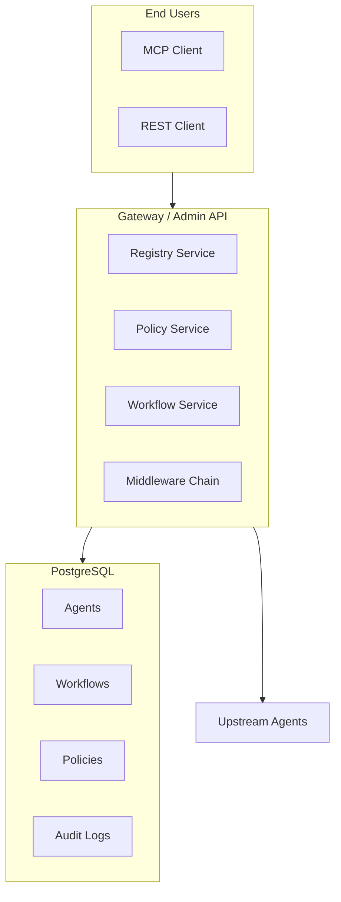
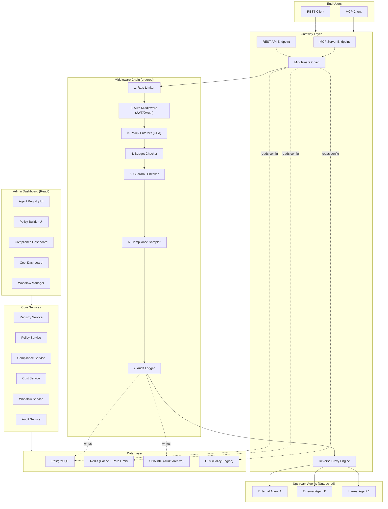

# AgentShield System Architecture

## Overview
**AgentShield** is an Agent Governance Firewall that acts as a transparent proxy between end users and AI agents/workflows. It enforces authentication, authorization, compliance, cost controls, and guardrails via an admin dashboard.

## Key Features
- **Agent Registry**: Centralized management of internal and external agents across REST, MCP, A2A, and gRPC protocols.
- **Workflow Orchestration**: Combining multiple agents into multi-step pipelines with numbered steps and data flow rules.
- **Policy Engine**: Access control policies (Allow/Deny) based on subject (user role, email) and resource (agent/workflow slug) attributes.
- **Policy Playground**: A simulation environment to test policy evaluations against various user contexts without invoking actual agents.
- **Audit Logging**: Immutable, append-only trail of all firewall events with detailed visualization.
- **Cost & Budgeting**: Token-based and cost-based limits for users, teams, and projects.
- **Compliance Sampling**: Configurable request/response sampling for regulatory frameworks like SOX or HIPAA.

## Tech Stack
- **Backend**: Node.js / Express (Go-based gateway in production plan).
- **Database**: PostgreSQL (relational integrity, JSONB support).
- **Frontend**: React + Vite + Tailwind/Glassmorphism.
- **Policy Language**: OPA / Rego (simulated via JS logic in MVP).

## Architecture Diagram

## Full System Architecture (Production Plan)

