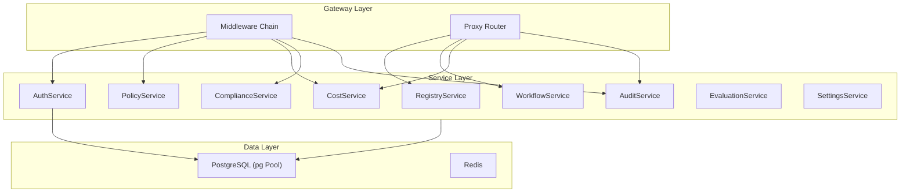

# Backend Services

AgentShield's backend is organized into 10 service classes, each responsible for a specific domain. All services are singletons exported from their respective modules.

> **Source**: [`agentshield/src/`](file:///Users/krishnakollepara/AntiGravityProjects/agentshield/src/)

---

## Architecture Overview

---

## AuthService

> **Source**: [`src/admin/auth.js`](file:///Users/krishnakollepara/AntiGravityProjects/agentshield/src/admin/auth.js) (107 lines)

Handles user authentication with JWT tokens and bcrypt password hashing.

| Method | Description |
|--------|-------------|
| `login(email, password)` | Validates credentials, returns JWT + refresh token + user profile |
| `createUser(data)` | Creates a new user with bcrypt-hashed password |
| `listUsers()` | Lists all users (excludes password hash) |
| `generateToken(user)` | Signs JWT with `{ id, email, role, department }` |
| `generateRefreshToken(user)` | Signs refresh token with `{ id, type: 'refresh' }` |
| `refreshToken(refreshToken)` | Verifies refresh token, issues new access token |

**Key details:**
- Passwords hashed with bcrypt (10 rounds)
- JWT expiry configurable via `JWT_EXPIRES_IN` (default: 15m)
- Refresh token expiry: `JWT_REFRESH_EXPIRES_IN` (default: 7d)
- Updates `last_login_at` on successful login

---

## RegistryService

> **Source**: [`src/registry/service.js`](file:///Users/krishnakollepara/AntiGravityProjects/agentshield/src/registry/service.js) (277 lines)

Central agent management: registration, discovery, health tracking, and A2A Agent Card import.

| Method | Description |
|--------|-------------|
| `registerAgent(agentData, createdBy)` | Creates agent with auto-generated slug if not provided |
| `listAgents(filters)` | Paginated list with 10+ filter/sort options |
| `getAgent(idOrSlug)` | Lookup by UUID or slug (auto-detected) |
| `updateAgent(idOrSlug, updates)` | Partial update with camelCase → snake_case conversion |
| `deactivateAgent(idOrSlug)` | Soft-delete: sets `is_active = false` |
| `updateHealthStatus(agentId, status, consecutiveFailures)` | Called by health checker |
| `importFromAgentCard(url, createdBy)` | Fetches A2A `.well-known/agent.json` and registers |
| `getStats()` | Dashboard stats: total, active, healthy, by protocol/type |

**Key details:**
- Agent lookup auto-detects UUID vs slug format using regex
- Slug auto-generation via `slugify()` helper
- Protocols supported: `a2a`, `mcp`, `rest`, `grpc`
- Agent types: `external`, `internal`

---

## PolicyService

> **Source**: [`src/policy/service.js`](file:///Users/krishnakollepara/AntiGravityProjects/agentshield/src/policy/service.js) (206 lines)

Rule-based policy evaluation engine with 12 condition operators.

| Method | Description |
|--------|-------------|
| `evaluate(context)` | Core engine: evaluates all active policies against request context |
| `_evaluatePolicy(policy, context)` | Tests a single policy's subjects, resources, and conditions |
| `_evaluateCondition(condition, data)` | Tests one condition with operator logic |
| `_getNestedValue(obj, path)` | Dot-notation property accessor (e.g., `user.role`) |
| `createPolicy(data, createdBy)` | CRUD: create |
| `listPolicies(filters)` | CRUD: list (filterable by type, active status) |
| `getPolicy(id)` / `updatePolicy(id, updates)` / `deletePolicy(id)` | CRUD operations |

### Evaluation Logic

1. Fetch all active `access_control` policies, ordered by priority (ASC)
2. For each policy, evaluate in order:
   - **Subject conditions** (ALL must match) — e.g., `user.role eq admin`
   - **Resource conditions** (ANY must match) — e.g., `agent.slug eq gpt4-analyst`
   - **Additional conditions** (ALL must match) — e.g., `time between [8, 18]`
3. First matching policy determines the outcome (`allow` or `deny`)
4. **No policies defined** → default allow
5. **No policy matched** → default deny

### Supported Operators

| Operator | Description | Example |
|----------|-------------|---------|
| `eq` | Equals | `role eq "admin"` |
| `neq` | Not equals | `role neq "guest"` |
| `in` | Value in array | `role in ["admin", "editor"]` |
| `not_in` | Value not in array | `department not_in ["public"]` |
| `contains` | String contains | `email contains "@company.com"` |
| `starts_with` | String starts with | `slug starts_with "internal-"` |
| `gt` / `gte` | Greater than (or equal) | `priority gt 50` |
| `lt` / `lte` | Less than (or equal) | `cost lte 1000` |
| `exists` | Not null/undefined | `mfa_verified exists` |
| `between` | Range check | `time between [8, 18]` |

---

## WorkflowService

> **Source**: [`src/workflow/service.js`](file:///Users/krishnakollepara/AntiGravityProjects/agentshield/src/workflow/service.js) (205 lines)

Multi-step agent pipeline orchestration with transactional step management.

| Method | Description |
|--------|-------------|
| `createWorkflow(data, createdBy)` | Creates workflow + agent steps in a single transaction |
| `listWorkflows(filters)` | Lists with joined agent details (name, slug, step order) |
| `getWorkflow(idOrSlug)` | Full workflow with agent step configuration |
| `updateWorkflow(idOrSlug, updates)` | Partial update (name, description, limits) |
| `toggleWorkflow(idOrSlug, isEnabled)` | Enable/disable workflow |
| `deleteWorkflow(idOrSlug)` | Cascading delete (removes agent steps) |
| `addAgentStep(idOrSlug, agentId, stepOrder, config)` | Add agent to pipeline |
| `removeAgentStep(idOrSlug, agentId)` | Remove agent from pipeline |

**Key details:**
- Uses `db.transaction()` for atomic workflow+steps creation
- Agent steps include: `step_order`, `is_optional`, `config`, `data_flow_rules`
- Workflow execution is sequential: output of step N becomes input for step N+1

---

## AuditService

> **Source**: [`src/audit/service.js`](file:///Users/krishnakollepara/AntiGravityProjects/agentshield/src/audit/service.js) (143 lines)

Append-only audit event logging with advanced querying.

| Method | Description |
|--------|-------------|
| `log(event)` | Write an audit entry (never throws — silently catches errors) |
| `query(filters)` | Paginated query with 10+ filters + full-text search |
| `getFilterOptions()` | Distinct event types and resource types for UI dropdowns |
| `getStats(since)` | Aggregated stats: total, allowed, denied, errors, avg latency |

**Key details:**
- Immutable: PostgreSQL rules prevent UPDATE and DELETE on `audit_log` table
- Full-text search across `action`, `trace_id`, and `details` JSONB
- Max 500 results per query
- Latency tracking via `latency_ms` column

---

## CostService

> **Source**: [`src/cost/service.js`](file:///Users/krishnakollepara/AntiGravityProjects/agentshield/src/cost/service.js) (224 lines)

Token usage tracking and budget enforcement.

| Method | Description |
|--------|-------------|
| `recordUsage(usageData)` | Records token/cost usage per request |
| `checkBudget(userId, teamId, departmentId)` | Pre-flight budget check (used by middleware) |
| `_updateBudgets(userId, tokens, costCents)` | Increments budget counters |
| `_isPeriodExpired(budget)` | Checks if period (daily/weekly/monthly/quarterly) has rolled over |
| `_resetBudget(budgetId)` | Zero-resets counters and advances period start |
| `createBudget(data)` / `listBudgets()` / `updateBudget()` | CRUD operations |
| `getUsageReport(filters)` | Usage report grouped by agent |
| `getStats()` | Aggregated cost statistics |

---

## ComplianceService

> **Source**: [`src/compliance/service.js`](file:///Users/krishnakollepara/AntiGravityProjects/agentshield/src/compliance/service.js) (~880 lines)  
> **OSCAL Parser**: [`src/compliance/oscal-parser.js`](file:///Users/krishnakollepara/AntiGravityProjects/agentshield/src/compliance/oscal-parser.js)

Regulatory compliance: sampling, PII detection, encryption, framework-specific rule evaluation, and NIST OSCAL catalog import/export.

| Method | Description |
|--------|-------------|
| `shouldSample(agentId, workflowId)` | Determines if a request should be sampled (probabilistic) |
| `storeSample(sampleData)` | SHA-256 hashes + AES-256-GCM encrypts request/response bodies |
| `detectPII(text)` | Regex-based PII detection (SSN, email, phone, credit card, DOB, IP, medical terms) |
| `_encrypt(text)` / `_decrypt(encryptedText)` | AES-256-GCM encryption/decryption |
| `getFrameworkRules(framework)` | Loads framework-specific validation rules from DB (built-in + OSCAL) |
| `generateSamples(framework, agentInfo)` | Auto-generates test inputs for compliance checking |
| `evaluateRule(rule, samples, configData, agentReachable)` | Evaluates a single rule against sample data |
| `invokeAgent(agent, sampleInput)` | Invokes a real agent for live compliance testing |
| `runComplianceCheck(configId, customInputs, userId)` | Full check: load rules → generate/use samples → evaluate → store results |
| `getChecks(configId)` / `getConfig(configId)` | Query check history |
| **OSCAL Methods** | |
| `importOscalCatalog(oscalJson, framework, selectedGroupIds, userId)` | Parse + import OSCAL catalog → compliance rules |
| `listOscalCatalogs()` | List imported OSCAL catalogs |
| `deleteOscalCatalog(catalogId)` | Delete catalog + cascade to imported rules |
| `validateOscal(oscalJson)` | Validate OSCAL JSON structure |
| `previewOscalCatalog(oscalJson)` | Parse without saving — returns groups/controls |
| `exportOscalAssessmentResult(checkId)` | Export compliance check as OSCAL Assessment Result JSON |

### OscalParser (Utility Module)

| Method | Description |
|--------|-------------|
| `validate(oscalJson)` | Check for required OSCAL fields (uuid, metadata, groups/controls) |
| `parseCatalog(oscalJson)` | Parse catalog → normalized groups + controls (recursive) |
| `controlToRule(control, framework, catalogId)` | Convert OSCAL control → compliance_rules row format |
| `generateAssessmentResult(checkResult, catalogMeta, systemInfo)` | Generate OSCAL Assessment Results document |

---

## EvaluationService

> **Source**: [`src/evaluation/service.js`](file:///Users/krishnakollepara/AntiGravityProjects/agentshield/src/evaluation/service.js) (917 lines)

The largest service — implements the Three-Layer Agent Evaluation Module with LLM-as-a-Judge and persona-driven simulation.

| Method | Description |
|--------|-------------|
| `_loadEvalSettings()` | Loads settings from DB with 5-minute cache |
| `createSuite(data)` / `listSuites()` / `getSuite()` / `updateSuite()` / `deleteSuite()` | Suite CRUD |
| `runEvaluation(suiteId, judgeModelKey, userId)` | Main evaluation runner |
| `_evaluateScenario(agent, scenario, judgeConfig)` | Evaluates one scenario: invoke → parse → judge |
| `_invokeAndCapture(agent, input)` | Invokes agent and captures response + metadata |
| `_parseAgentBehavior(rawResponse)` | Extracts content from various agent response formats |
| `_judgeScenario(scenario, agentResponse, judgeConfig)` | LLM-as-a-Judge or rule-based scoring |
| `_ruleBasedJudge(scenario, agentResponse)` | Regex + heuristic fallback judge |
| `_computeLayerScores(results)` | Computes Node → Session → System layer scores |
| `generatePersonaScenarios(agent, personaConfig)` | Generates scenarios from persona templates |
| `_resolveJudgeConfig(judgeModelKey)` | Resolves LLM API key from settings |
| `_resolveAgentAuth(agent)` | Resolves API keys from settings for agent invocation |

See [Evaluation Module](../features/evaluation-module.md) for detailed documentation.

---

## SettingsService

> **Source**: [`src/settings/service.js`](file:///Users/krishnakollepara/AntiGravityProjects/agentshield/src/settings/service.js) (126 lines)

Key-value settings store and compliance rules management.

| Method | Description |
|--------|-------------|
| `getSettings(category)` | Get all settings in a category |
| `getSetting(category, key)` | Get a specific setting |
| `upsertSetting({ category, key, value, description })` | Create or update (upsert on `category + key`) |
| `deleteSetting(id)` | Delete a setting |
| `getComplianceRules(framework)` | List all rules for a framework |
| `getEnabledRules(framework)` | List only enabled rules |
| `upsertComplianceRule(...)` | Create or update a compliance rule |
| `toggleRule(id, isEnabled)` | Enable/disable a rule |
| `deleteRule(id)` | Delete (only non-builtin rules) |
| `getAllChecksHistory(limit)` | Global compliance check history |

---

## GuardrailsService

**File**: [`src/guardrails/service.js`](file:///Users/krishnakollepara/AntiGravityProjects/agentshield/src/guardrails/service.js)

Manages guardrail profiles, rules, agent assignments, test runs, and YAML import/export.

| Method | Description |
|--------|-------------|
| `createProfile(data)` | Create a new guardrail profile |
| `getProfile(id)` | Get profile with rules and assigned agents |
| `updateProfile(id, data)` | Update profile name/description/mode |
| `deleteProfile(id)` | Delete profile and cascade rules |
| `addRule(profileId, ruleData)` | Add a rule to a profile |
| `deleteRule(ruleId)` | Delete a rule |
| `assignToAgent(agentId, profileId)` | Assign profile to agent |
| `unassignFromAgent(agentId, profileId)` | Remove assignment |
| `evaluate(agentId, content, direction)` | Runtime enforcement — evaluate content against assigned guardrails |
| `runTests(profileId, testCases)` | Execute test suite against a profile |
| `exportProfileYaml(profileId)` | **Phase 3** — Export profile + rules as YAML |
| `importProfileYaml(yamlString, userId)` | **Phase 3** — Import profile from YAML |
| `previewYaml(yamlString)` | **Phase 3** — Validate/preview YAML without saving |

### YamlGuardrailParser (Utility Module)

**File**: [`src/guardrails/yaml-parser.js`](file:///Users/krishnakollepara/AntiGravityProjects/agentshield/src/guardrails/yaml-parser.js)

Handles bidirectional conversion between YAML format and DB schema. Supports type aliases (e.g., `pii-shield` → `pii_shield`), config flattening for readability, and schema validation.

---

## Database Layer

> **Source**: [`src/db/index.js`](file:///Users/krishnakollepara/AntiGravityProjects/agentshield/src/db/index.js) (85 lines)

Thin wrapper around `pg.Pool` providing:

| Function | Description |
|----------|-------------|
| `query(text, params)` | Execute parameterized SQL with debug logging |
| `getClient()` | Get a pool client for transactions (with 10s checkout warning) |
| `transaction(callback)` | Execute callback within `BEGIN/COMMIT/ROLLBACK` |
| `healthCheck()` | `SELECT NOW()` to verify connectivity |
| `close()` | Gracefully close the pool |

---

## Health Checker

> **Source**: [`src/registry/health.js`](file:///Users/krishnakollepara/AntiGravityProjects/agentshield/src/registry/health.js)

Background process that periodically checks agent health:

- Runs on interval (`HEALTH_CHECK_INTERVAL_MS`, default 30s)
- Pings `health_check_url` or `endpoint_url` for each active agent
- Updates `health_status` via `RegistryService.updateHealthStatus()`
- Tracks consecutive failure count
- After threshold failures → marks agent as `unhealthy`
