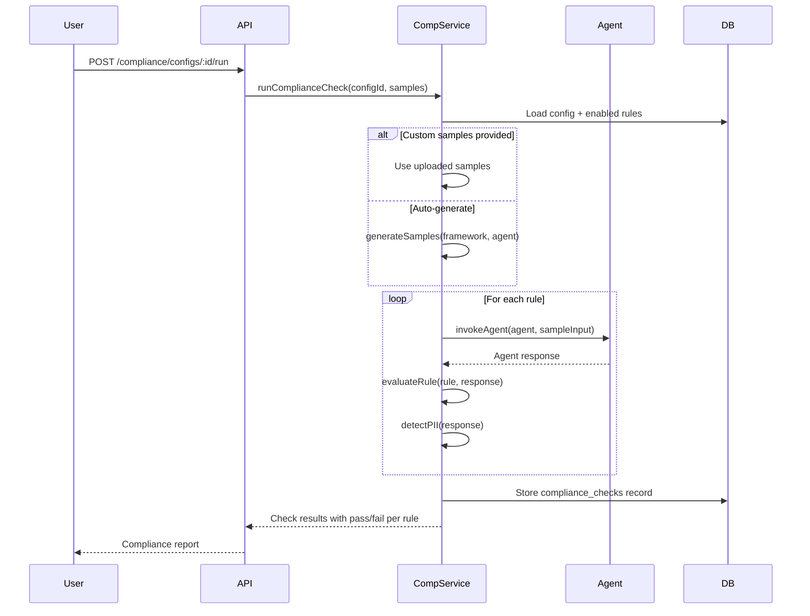

# Compliance Engine

AgentShield's Compliance Engine provides regulatory compliance monitoring through probabilistic request/response sampling, PII detection, encrypted storage, and framework-specific rule evaluation.

> **Source**: [`src/compliance/service.js`](file:///Users/krishnakollepara/AntiGravityProjects/agentshield/src/compliance/service.js) (677 lines)

---

## Supported Frameworks

| Framework | Description | Default Retention | Built-in Rules |
|-----------|-------------|-------------------|----------------|
| **SOX** | Sarbanes-Oxley (financial data integrity) | 7 years | 5 rules |
| **HIPAA** | Health Insurance Portability (PHI protection) | 6 years (2190 days) | 5 rules |
| **GDPR** | General Data Protection Regulation (EU PII) | Per consent | 5 rules |
| **PCI-DSS** | Payment Card Industry (cardholder data) | 1 year | 5 rules |
| **Custom** | User-defined compliance rules | Configurable | User-created |

---

## Compliance Configuration

A compliance config defines what to monitor:

```json
{
  "name": "HIPAA Monitoring",
  "framework": "hipaa",
  "sample_rate": 0.10,
  "applies_to": { "agents": ["medical-agent"], "workflows": ["patient-intake"] },
  "retention_days": 2190,
  "pii_detection": true,
  "is_active": true
}
```

| Field | Description |
|-------|-------------|
| `sample_rate` | Probability of sampling a request (0.0 – 1.0) |
| `applies_to` | JSONB filter for target agents/workflows |
| `retention_days` | How long to retain encrypted samples |
| `pii_detection` | Enable automatic PII scanning |

---

## PII Detection

The engine scans agent request/response bodies for personally identifiable information using regex patterns:

| PII Type | Pattern |
|----------|---------|
| **SSN** | `\b\d{3}-\d{2}-\d{4}\b` |
| **Email** | Standard email regex |
| **Phone** | 10-digit US format (`\b\d{3}[-.]?\d{3}[-.]?\d{4}\b`) |
| **Credit Card** | 13-19 digit card numbers |
| **Date of Birth** | `\b\d{2}/\d{2}/\d{4}\b` and `\b\d{4}-\d{2}-\d{2}\b` |
| **IP Address** | IPv4 format |
| **Medical Terms** | Diagnosis, prescription, patient, medical record keywords |

When PII is detected:
- `pii_detected` flag is set to `true` on the sample
- `pii_types` JSONB array lists all detected categories
- Sample is flagged for compliance review

---

## Encrypted Sample Storage

All compliance samples are secured with defense-in-depth:

1. **Integrity**: SHA-256 hash of request and response bodies (`request_hash`, `response_hash`)
2. **Encryption**: AES-256-GCM encryption of request and response bodies
   - Key: `COMPLIANCE_ENCRYPTION_KEY` env var (must be 32 bytes)
   - Each sample uses a unique 16-byte IV
   - Authentication tag prevents tampering
3. **Storage**: Encrypted content stored as `BYTEA` in PostgreSQL

```
Request/Response → SHA-256 Hash → AES-256-GCM Encrypt → Store (BYTEA)
```

---

## Sampling Middleware

The `complianceSampler` middleware (step 6 in the gateway chain) handles sampling:

1. **Decision**: `shouldSample(agentId, workflowId)` checks active configs and their sample rates
2. **Capture**: Non-blocking — wraps `res.json()` to capture response body asynchronously
3. **Storage**: Runs in background — never blocks HTTP response
4. **PII scan**: Automatically runs `detectPII()` on both request and response bodies

---

## Framework Rules

Each framework ships with 5 built-in rules (seeded via migration `003_settings_and_rules.sql`):

### SOX Rules
| Rule ID | Name | Severity |
|---------|------|----------|
| `sox-1` | Financial Data Integrity | Critical |
| `sox-2` | Segregation of Duties | Critical |
| `sox-3` | Access Logging Completeness | High |
| `sox-4` | PII in Financial Data | High |
| `sox-5` | Approval Trail Verification | Medium |

### HIPAA Rules
| Rule ID | Name | Severity |
|---------|------|----------|
| `hipaa-1` | PHI Detection | Critical |
| `hipaa-2` | Encryption Adequacy | Critical |
| `hipaa-3` | Access Control Verification | High |
| `hipaa-4` | Minimum Necessary Rule | High |
| `hipaa-5` | Data Retention Compliance | Medium |

### GDPR Rules
| Rule ID | Name | Severity |
|---------|------|----------|
| `gdpr-1` | PII Detection | Critical |
| `gdpr-2` | Consent Tracking | Critical |
| `gdpr-3` | Right to Erasure Support | High |
| `gdpr-4` | Data Minimization | High |
| `gdpr-5` | Cross-Border Transfer Check | Medium |

### PCI-DSS Rules
| Rule ID | Name | Severity |
|---------|------|----------|
| `pci-1` | Credit Card Data Detection | Critical |
| `pci-2` | Encryption Standards | Critical |
| `pci-3` | Access Control | High |
| `pci-4` | Audit Trail Completeness | High |
| `pci-5` | Network Segmentation | Medium |

---

## Compliance Check Workflow



**Check Results:**
- Status: `passed` | `failed` | `partial`
- Per-rule breakdown with pass/fail + reason
- Sample source: `generated` | `uploaded` | `mixed`

---

## Rule Management

Rules can be managed via the dashboard or API:

- **Built-in rules**: Cannot be deleted, only enabled/disabled
- **Custom rules**: Full CRUD support
- **Bulk import**: Upload CSV/XLSX files with columns: `name`, `description`, `category`, `severity`, `pass_input`, `pass_output`, `fail_input`, `fail_output`

---

## Database Tables

| Table | Description |
|-------|-------------|
| `compliance_configs` | Framework configurations with sample rates and retention |
| `compliance_samples` | Encrypted request/response pairs with PII flags |
| `compliance_checks` | Check run results with per-rule scores |
| `compliance_rules` | Framework-specific rules (built-in + custom) |
