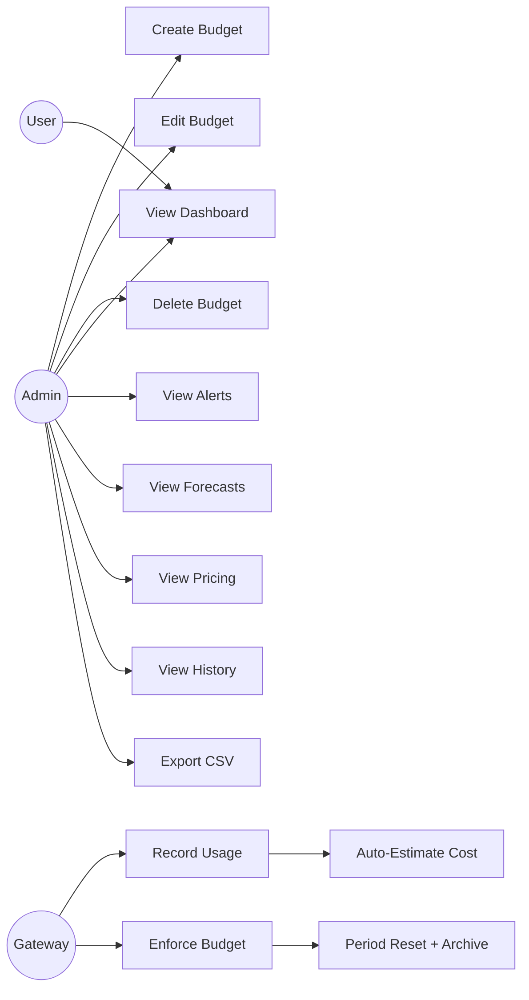

# Cost Management — Use Cases

AgentShield's Cost Management module provides token-level and cost-level budget enforcement, usage tracking, cost estimation, alerting, and forecasting for AI agent operations.

> **Source Files**:
> - Backend: [`src/cost/service.js`](file:///Users/krishnakollepara/AntiGravityProjects/agentshield/src/cost/service.js)
> - Frontend: [`src/pages/CostManagement.jsx`](file:///Users/krishnakollepara/AntiGravityProjects/agentshield-dashboard/src/pages/CostManagement.jsx)
> - API Routes: [`src/admin/routes.js`](file:///Users/krishnakollepara/AntiGravityProjects/agentshield/src/admin/routes.js)
> - Migration: [`migrations/007_cost_enhancements.sql`](file:///Users/krishnakollepara/AntiGravityProjects/agentshield/migrations/007_cost_enhancements.sql)

---

## Actors

| Actor | Description |
|-------|-------------|
| **Admin** | Creates, edits, and deletes budgets. Views all cost data and reports. |
| **User** | Invokes agents/workflows. Their usage is tracked and constrained by budgets. |
| **Gateway** | Proxies agent/workflow invocations. Records token usage and enforces budgets pre-request. |
| **CostService** | Core backend service. Records usage, checks budgets, auto-estimates cost, archives periods. |
| **System (Cron)** | Period auto-reset triggered on next budget evaluation after expiry. |

---

## UC-01: Record Token & Cost Usage

**Primary Actor**: Gateway  
**Precondition**: An agent or workflow invocation completes successfully and returns a `usage` object.

### Flow

1. Gateway extracts `input_tokens`, `output_tokens`, `model_name`, and optionally `cost_cents` from the agent response.
2. Gateway calls `costService.recordUsage()` with the usage data plus user context (`userId`, `teamId`, `department`).
3. CostService checks if `cost_cents > 0`; if not, it runs `estimateCost()` using the built-in **Model Pricing Table** to auto-calculate cost from token counts and model name.
4. CostService inserts a record into the `cost_records` table.
5. CostService calls `_updateBudgets()` to increment `current_tokens` and `current_cost_cents` on **all matching budget scopes** (user, team, department, agent, global).

### Alternative Flows

- **A1 — Unknown model**: `estimateCost()` returns 0 if the model is not in the pricing table. Cost is recorded as 0.
- **A2 — No usage object**: Gateway skips cost tracking entirely (no record inserted).

### Postcondition

A `cost_records` row is persisted with accurate token counts and estimated (or actual) cost.

---

## UC-02: Enforce Budget Pre-Request

**Primary Actor**: Gateway (via `budgetChecker` middleware)  
**Precondition**: A user sends a request to invoke an agent or workflow.

### Flow

1. Middleware calls `costService.checkBudget(userId, teamId, departmentId, agentId)`.
2. CostService looks up all active budgets matching the user's scopes (user → team → department → agent → global).
3. For each budget:
   - Check if the period has expired. If yes, **archive** the current period to `budget_history` and **reset** the counters.
   - Compare `current_tokens` against `token_limit` and `current_cost_cents` against `cost_limit_cents`.
4. Return the budget check result.

### Alternative Flows

- **A1 — Hard limit exceeded**: Returns `{ allowed: false }` → Gateway responds with **`402 BUDGET_EXCEEDED`**.
- **A2 — Soft limit exceeded (warn only)**: Returns `{ allowed: true }` but logs a warning. Request proceeds.
- **A3 — Warn threshold reached**: Logs `Budget warning: team "engineering" at 85.2% token usage`. Request proceeds.
- **A4 — No budgets match**: Returns `{ allowed: true }`. Request proceeds without constraint.

### Postcondition

Request is either allowed to proceed or blocked with a descriptive error.

---

## UC-03: Create Budget

**Primary Actor**: Admin  
**Precondition**: Admin is authenticated with the `admin` role.

### Flow

1. Admin opens the Cost Management page and clicks **"Create Budget"**.
2. Admin fills the form:
   - **Name**: Descriptive label (e.g. "Engineering Monthly")
   - **Scope Type**: `user`, `team`, `department`, `agent`, `workflow`, `project`, or `global`
   - **Scope ID**: Identifier for the scope (e.g. team slug, agent UUID)
   - **Token Limit**: Maximum tokens per period
   - **Cost Limit ($)**: Maximum cost per period
   - **Period**: `daily`, `weekly`, `monthly`, or `quarterly`
   - **Warn Threshold (%)**: Percentage at which alerts trigger (default: 80%)
   - **Hard Limit**: Toggle between blocking requests vs. logging warnings
3. Admin clicks **"Create"**.
4. Frontend calls `POST /budgets` with the payload.
5. Backend inserts into the `budgets` table with `current_tokens = 0`, `current_cost_cents = 0`, `period_start = NOW()`.

### Postcondition

A new budget is active and will be enforced on the next matching request.

---

## UC-04: Edit Budget

**Primary Actor**: Admin  
**Precondition**: At least one budget exists.

### Flow

1. Admin navigates to the **Budgets** tab.
2. Admin clicks the **pencil icon** on a budget card.
3. The edit modal opens pre-filled with the budget's current values.
4. Admin modifies one or more fields (e.g. increases token limit, changes warn threshold).
5. Admin clicks **"Save Changes"**.
6. Frontend calls `PUT /budgets/:id` with the updated fields.
7. Backend updates the `budgets` row and sets `updated_at = NOW()`.

### Postcondition

The budget's limits/configuration are updated. Running counters (`current_tokens`, `current_cost_cents`) are preserved.

---

## UC-05: Delete Budget

**Primary Actor**: Admin  
**Precondition**: At least one budget exists.

### Flow

1. Admin clicks the **trash icon** on a budget card.
2. A confirmation dialog appears: _"Are you sure you want to delete this budget?"_
3. Admin confirms.
4. Frontend calls `DELETE /budgets/:id`.
5. Backend deletes the `budgets` row. Cascade also removes any `budget_history` entries for that budget.

### Alternative Flows

- **A1 — Cancel**: Admin clicks "Cancel" → no action taken.

### Postcondition

The budget is permanently removed and no longer enforced.

---

## UC-06: View Cost Overview Dashboard

**Primary Actor**: Admin / User  
**Precondition**: User is authenticated.

### Flow

1. User navigates to the **Cost Management** page → **Overview** tab.
2. The page loads data from 4 parallel API calls:
   - `GET /cost/stats` → stat cards (total spend, tokens, 24h usage, request count)
   - `GET /cost/daily?days=30` → daily usage trend area chart
   - `GET /cost/report` → per-agent token usage bar chart
   - `GET /budgets/alerts` → alert banners for budgets near/above limits
3. The user sees:
   - **Stat Cards**: Total spend, last-24h tokens, total requests, active budgets count
   - **Daily Usage Trend**: Dual-axis area chart showing tokens + cost over the last 30 days
   - **Token Usage by Agent**: Bar chart showing per-agent token consumption
   - **Budget Forecasting Table**: Projected burn rates and days-until-exhaustion per budget

### Postcondition

User has a comprehensive view of cost and usage across the system.

---

## UC-07: Budget Alerts

**Primary Actor**: System / Admin  
**Precondition**: At least one budget exists with `warn_threshold` configured.

### Flow

1. On page load, frontend calls `GET /budgets/alerts`.
2. Backend queries budgets where `current_tokens / token_limit >= warn_threshold` OR `current_cost_cents / cost_limit_cents >= warn_threshold`.
3. Frontend renders alert banners at the top of the Cost Management page:
   - **Warning (yellow)**: Budget is approaching its limit (at or above warn threshold but below 100%).
   - **Danger (red)**: Budget is exceeded (at or above 100%). If `hard_limit = true`, displays "BLOCKING REQUESTS".
4. Budget cards in the Budgets tab show a border highlight and warning icon for alerted budgets.

### Postcondition

Admin is visually alerted to budgets needing attention.

---

## UC-08: Cost Forecasting

**Primary Actor**: Admin  
**Precondition**: At least one budget exists with non-zero current usage.

### Flow

1. Frontend calculates forecasts from budget data (client-side computation):
   - **Daily burn rate**: `current_tokens / elapsed_days_in_period`
   - **Days until exhausted**: `remaining_capacity / daily_burn`
   - **Projected total**: `daily_burn × period_days`
   - **Will exceed**: `true` if projected exhaustion is before period end
2. Results are rendered in a forecasting table with columns: Budget, Scope, Daily Burn Rate, Days Until Exhausted, Projected Total, Status.
3. Status badge shows:
   - 🟢 **On Track**: Projected usage will not exceed the limit within the period.
   - 🔴 **Will Exceed**: Projected to exceed before the period resets.

### Postcondition

Admin can proactively adjust budgets before they are exhausted.

---

## UC-09: Auto-Estimate Cost via Model Pricing

**Primary Actor**: CostService (automatic)  
**Precondition**: An agent response includes token counts and a `model_name` but no `cost_cents`.

### Flow

1. `recordUsage()` receives usage data with `cost_cents = 0` and `model_name = "gpt-4o"`.
2. `estimateCost("gpt-4o", inputTokens, outputTokens)` looks up the model in the pricing table.
3. Calculates: `(inputTokens × inputPricePerToken) + (outputTokens × outputPricePerToken)`.
4. Returns the estimated cost in cents, which is stored in `cost_records.cost_cents`.

### Supported Models

| Provider | Models |
|----------|--------|
| OpenAI | gpt-4o, gpt-4o-mini, gpt-4-turbo, gpt-4, gpt-3.5-turbo, o1, o1-mini, o3-mini |
| Anthropic | claude-sonnet-4, claude-3.5-sonnet, claude-3.5-haiku, claude-3-opus |
| Google | gemini-2.5-pro, gemini-2.5-flash, gemini-2.0-flash, gemini-1.5-pro, gemini-1.5-flash |
| Meta/OSS | llama-3.1-70b, llama-3.1-8b, mixtral-8x7b |

### Alternative Flows

- **A1 — Unknown model**: `estimateCost()` returns 0. The record is stored with `cost_cents = 0`.

### Postcondition

Cost is realistically estimated even when the upstream provider doesn't return cost data.

---

## UC-10: View Model Pricing Reference

**Primary Actor**: Admin  
**Precondition**: User is authenticated.

### Flow

1. Admin navigates to the **Model Pricing** tab.
2. Frontend calls `GET /cost/model-pricing`.
3. Backend returns the in-memory pricing table as an array of `{ model, inputPer1M, outputPer1M }`.
4. UI renders a table with columns: Model, Vendor badge, Input ¢/1M, Output ¢/1M, Input $/1M, Output $/1M.
5. Admin can click **"Export"** to download the pricing table as CSV.

### Postcondition

Admin has visibility into the pricing assumptions used for cost estimation.

---

## UC-11: Budget Period Auto-Reset with History Archive

**Primary Actor**: System (triggered during `checkBudget`)  
**Precondition**: A budget's period has elapsed (e.g. a monthly budget is 31+ days old).

### Flow

1. During `checkBudget()`, `_isPeriodExpired(budget)` returns `true`.
2. `_archiveAndResetBudget(budget)` is called:
   - Inserts a `budget_history` row with `final_tokens`, `final_cost_cents`, `period_start`, `period_end = NOW()`.
   - Resets the budget's `current_tokens` and `current_cost_cents` to 0.
   - Advances `period_start` to `NOW()`.
3. The next request proceeds against the fresh budget.

### Alternative Flows

- **A1 — `budget_history` table missing**: Archive step is skipped with a warning log. Reset still occurs.

### Postcondition

Historical usage data is preserved. The budget starts a fresh period.

---

## UC-12: View Budget History

**Primary Actor**: Admin  
**Precondition**: At least one budget period has been archived.

### Flow

1. Admin navigates to the **Budget History** tab.
2. Frontend calls `GET /budgets/history/all`.
3. Backend returns up to 50 most recent history entries ordered by `period_end DESC`.
4. UI renders a table with columns: Budget, Scope, Period, Dates, Tokens Used, Cost, Utilization bar.
5. Admin can click **"Export"** to download the history as CSV.

### Postcondition

Admin can review historical budget utilization across past periods.

---

## UC-13: Export Cost Data as CSV

**Primary Actor**: Admin  
**Precondition**: Data exists for the export type.

### Flow

1. Admin clicks an **"Export CSV"** button on one of:
   - **Overview** tab → exports cost report (per-agent breakdown)
   - **Model Pricing** tab → exports the pricing table
   - **Budget History** tab → exports historical period data
2. Frontend generates CSV content client-side from the loaded data:
   - Constructs header row from object keys.
   - Escapes values containing commas or quotes.
3. Creates a `Blob` and triggers a browser download.

### Postcondition

A `.csv` file is downloaded to the admin's machine.

---

## UC-14: Per-Agent Budget Scoping

**Primary Actor**: Admin  
**Precondition**: An agent is registered in the Agent Registry.

### Flow

1. Admin creates a budget with **Scope Type = "agent"** and **Scope ID = agent UUID**.
2. When the agent is invoked through the gateway:
   - `recordUsage()` passes `agentId` to `_updateBudgets()`, which increments the agent-scoped budget.
   - `checkBudget()` includes the `agentId` scope in its lookup cascade.
3. If the agent-scoped budget is exceeded and `hard_limit = true`, the invocation is blocked with `402`.

### Example

> "GPT-4 Code Reviewer agent is limited to 2M tokens/month"

### Postcondition

Individual agents can be cost-constrained independently of user/team budgets.

---

## Use Case Diagram

