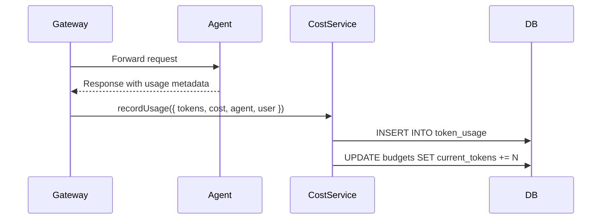

# Cost Management

AgentShield provides token-level and cost-level budget enforcement to control AI agent spending across users, teams, departments, and projects.

> **Source**: [`src/cost/service.js`](file:///Users/krishnakollepara/AntiGravityProjects/agentshield/src/cost/service.js) (224 lines)

---

## Budget Scopes

Budgets can be scoped to different organizational levels:

| Scope | Description | Example |
|-------|-------------|---------|
| `user` | Individual user budgets | "Developer A: 100K tokens/day" |
| `team` | Team-level budgets | "ML Team: $500/month" |
| `department` | Department budgets | "Engineering: 10M tokens/monthly" |
| `project` | Project-based budgets | "Q4 Demo: $200/weekly" |

---

## Budget Periods

| Period | Description |
|--------|-------------|
| `daily` | Resets every 24 hours |
| `weekly` | Resets every 7 days |
| `monthly` | Resets every 30 days |
| `quarterly` | Resets every 90 days |

Periods auto-reset when expired — the `_isPeriodExpired()` check runs during every budget evaluation.

---

## Budget Configuration

```json
{
  "name": "Engineering Monthly Budget",
  "scope_type": "department",
  "scope_id": "engineering",
  "token_limit": 10000000,
  "cost_limit_cents": 50000,
  "period": "monthly",
  "warn_threshold": 0.80,
  "hard_limit": true
}
```

| Field | Type | Description |
|-------|------|-------------|
| `token_limit` | bigint | Maximum tokens allowed per period |
| `cost_limit_cents` | bigint | Maximum cost in cents per period |
| `warn_threshold` | decimal | Percentage at which to generate warning (default: 80%) |
| `hard_limit` | boolean | If `true`, blocks requests when exceeded; if `false`, only warns |
| `current_tokens` | bigint | Running counter for current period |
| `current_cost` | bigint | Running cost counter for current period |

---

## How It Works

### Token/Cost Tracking

Every agent invocation through the gateway automatically records usage:



Usage data extracted from agent responses:
- `input_tokens` / `prompt_tokens`
- `output_tokens` / `completion_tokens`
- `cost_cents`
- `model` name

### Budget Enforcement (Middleware)

The `budgetChecker` middleware runs before every gateway request:

1. **Lookup** all budgets matching the user's ID, team, and department
2. **Check expiry** — auto-reset if period has elapsed
3. **Compare** current usage against limits
4. **Decision**:
   - ✅ **Within budget** → continue to agent
   - ❌ **Hard limit exceeded** → return `402 BUDGET_EXCEEDED`
   - ⚠️ **Warn threshold reached** → continue but log warning

### Period Auto-Reset

When a budget period expires (e.g., monthly budget rolls over):
1. `_isPeriodExpired(budget)` detects the rollover
2. `_resetBudget(budgetId)` zeros both counters and advances `period_start`
3. The request proceeds normally against the fresh budget

---

## Usage Reports

The cost service provides usage analytics:

- **Usage Report** (`GET /cost/report`) — Token and cost breakdown by agent, with date range filtering
- **Cost Stats** (`GET /cost/stats`) — Aggregated totals: total tokens, total cost, budget utilization

---

## Database Tables

| Table | Column | Type | Description |
|-------|--------|------|-------------|
| `budgets` | `id` | UUID | Primary key |
| | `scope_type` | varchar(20) | `user`, `team`, `department`, `project` |
| | `scope_id` | varchar(255) | Identifier for the scope |
| | `token_limit` | bigint | Max tokens per period |
| | `cost_limit_cents` | bigint | Max cost in cents per period |
| | `period` | varchar(20) | `daily`, `weekly`, `monthly`, `quarterly` |
| | `warn_threshold` | decimal(3,2) | Warning threshold (0.80 = 80%) |
| | `hard_limit` | boolean | Block requests when exceeded |
| | `current_tokens` | bigint | Running token count |
| | `current_cost` | bigint | Running cost count |
| | `period_start` | timestamptz | Start of current budget period |
| `token_usage` | `trace_id` | UUID | Request trace ID |
| | `agent_id` | UUID | Agent that consumed tokens |
| | `input_tokens` | bigint | Input/prompt tokens |
| | `output_tokens` | bigint | Output/completion tokens |
| | `cost_cents` | bigint | Cost in cents |
| | `model_name` | varchar | LLM model used |
