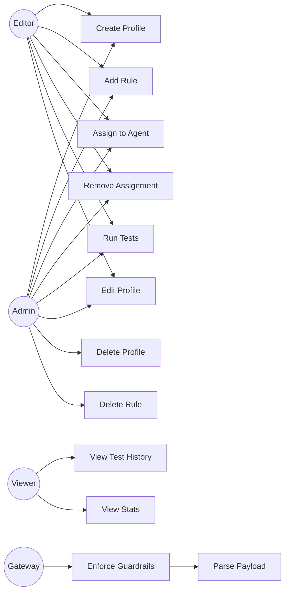

# Guardrails — Use Cases

AgentShield's Guardrails Module provides real-time content enforcement and compliance-style testing for AI agent I/O. Guardrail profiles define reusable rule sets that are optionally assigned to agents.

> **Source Files**:
> - Backend: [`src/guardrails/service.js`](file:///Users/krishnakollepara/AntiGravityProjects/agentshield/src/guardrails/service.js)
> - Frontend: [`src/pages/Guardrails.jsx`](file:///Users/krishnakollepara/AntiGravityProjects/agentshield-dashboard/src/pages/Guardrails.jsx)
> - API Routes: [`src/admin/routes.js`](file:///Users/krishnakollepara/AntiGravityProjects/agentshield/src/admin/routes.js)
> - Middleware: [`src/gateway/middleware/index.js`](file:///Users/krishnakollepara/AntiGravityProjects/agentshield/src/gateway/middleware/index.js) — `guardrailEnforcer`
> - Migration: [`migrations/009_guardrails.sql`](file:///Users/krishnakollepara/AntiGravityProjects/agentshield/migrations/009_guardrails.sql)

---

## Actors

| Actor | Description |
|-------|-------------|
| **Admin** | Creates, edits, and deletes guardrail profiles and rules. Assigns profiles to agents. Runs guardrail tests. |
| **Editor** | Can create profiles, add rules, assign to agents, and run tests. Cannot delete profiles. |
| **Viewer** | Can view profiles, rules, assignments, and test results. Read-only. |
| **Gateway** | Proxies agent invocations. Enforces guardrails in real-time via `guardrailEnforcer` middleware. |
| **GuardrailsService** | Core backend service. Evaluates rules, manages CRUD, executes test runs. |

---

## UC-01: Create Guardrail Profile

**Primary Actor**: Admin / Editor
**Precondition**: User is authenticated with `editor` or `admin` role.

### Flow

1. User opens the Guardrails page → **Profiles & Rules** tab.
2. User clicks **"New Profile"**.
3. Modal opens with fields: Name, Description, Enforcement Mode (`Block` or `Log Only`).
4. User fills the form and clicks **"Create Profile"**.
5. Frontend calls `POST /guardrails/profiles`.
6. Backend inserts a row into `guardrail_profiles` with `is_active = true`.

### Postcondition

A new guardrail profile exists. It has no rules and no agent assignments until configured.

---

## UC-02: Add Rule to Profile

**Primary Actor**: Admin / Editor
**Precondition**: At least one guardrail profile exists.

### Flow

1. User selects a profile from the list (detail panel opens on the right).
2. User clicks **"Add Rule"**.
3. Modal opens with fields: Name, Rule Type, Scope, Severity, Description, and type-specific configuration.
4. User selects a rule type (e.g., `PII Shield`) — the config editor dynamically updates:
   - **Content Filter**: Keyword list, case sensitivity toggle
   - **PII Shield**: Checkboxes for SSN, Credit Card, Email, Phone, DOB, MRN
   - **Prompt Injection**: Extra regex patterns (built-in patterns are always active)
   - **Topic Boundary**: Allowed topics list, blocked topics list
   - **Token Limit**: Max tokens number input
   - **Custom Regex**: JSON array of `{ pattern, flags, label }`
   - **Output Format**: JSON required toggle, max length
5. User clicks **"Add Rule"**.
6. Frontend calls `POST /guardrails/profiles/:id/rules`.
7. Backend inserts into `guardrail_rules`.

### Postcondition

The rule is added to the profile and will be evaluated during enforcement and test runs.

---

## UC-03: Assign Guardrail to Agent

**Primary Actor**: Admin / Editor
**Precondition**: At least one profile and one registered agent exist.

### Flow

1. User navigates to the **Agent Assignments** tab.
2. User selects an agent from the Agent dropdown.
3. User selects a guardrail profile from the Profile dropdown.
4. User clicks **"Assign"**.
5. Frontend calls `POST /guardrails/assign` with `{ agentId, profileId }`.
6. Backend inserts into `agent_guardrails`. `ON CONFLICT DO NOTHING` prevents duplicates.

### Alternative Flows

- **A1 — Agent already assigned**: No duplicate is created. Operation is idempotent.
- **A2 — Multiple profiles per agent**: An agent can have multiple profiles. All are evaluated during enforcement.

### Postcondition

The agent's requests will be evaluated against the profile's rules during gateway invocation.

---

## UC-04: Remove Guardrail Assignment

**Primary Actor**: Admin / Editor
**Precondition**: A profile-to-agent assignment exists.

### Flow

1. User selects a profile in the **Profiles & Rules** tab.
2. Under "Assigned Agents", the user clicks the **✕** button next to an agent name.
3. Frontend calls `DELETE /guardrails/assign` with `{ agentId, profileId }`.
4. Backend deletes the `agent_guardrails` row.

### Postcondition

The agent is no longer protected by that guardrail profile.

---

## UC-05: Real-Time Input Guardrail Enforcement

**Primary Actor**: Gateway (via `guardrailEnforcer` middleware)
**Precondition**: An agent has at least one active guardrail profile with enabled rules.

### Flow

1. Client sends `POST /api/v1/gateway/agent/:slug/invoke` with a request body.
2. `guardrailEnforcer` middleware intercepts the request (step 5.5 in the chain).
3. `guardrailsService.evaluateInput(slug, body)` is called:
   a. Resolves the agent slug to an agent ID.
   b. Retrieves all active guardrail profiles for the agent.
   c. For each profile, fetches enabled rules matching `scope = 'input'` or `scope = 'both'`.
   d. Evaluates each rule against the extracted text content.
4. Returns `{ allowed, violations[], sanitized }`.

### Alternative Flows

- **A1 — No guardrails assigned**: Returns `{ allowed: true }`. Request proceeds unmodified.
- **A2 — Violation in `block` mode (critical/high)**: Returns 422 with `GUARDRAIL_VIOLATION` code and violation details. Request does not reach the agent. Violation is audit-logged.
- **A3 — Violation in `log_only` mode**: Request proceeds. Violation is audit-logged and traced via OpenTelemetry.
- **A4 — Violation with `medium`/`low` severity**: Always logged, never blocks (regardless of profile mode).
- **A5 — Service error (fail-open)**: If the guardrails service throws, the error is logged but the request proceeds. The middleware never becomes a single point of failure.

### Postcondition

Allowed requests proceed to the agent. Blocked requests receive a 422 response. All violations are audit-logged.

---

## UC-06: Run Guardrail Tests

**Primary Actor**: Admin / Editor
**Precondition**: At least one guardrail profile with rules exists.

### Flow

1. User navigates to the **Test Runner** tab.
2. User selects a guardrail profile from the dropdown.
3. User adds test cases:
   - **Input**: The text to evaluate (e.g., "My SSN is 123-45-6789")
   - **Expected Verdict**: `block` or `pass`
   - **Direction**: `input` or `output`
   - **Description**: Human-readable label
4. User clicks **"▶ Run Guardrail Tests"**.
5. Frontend calls `POST /guardrails/profiles/:id/test` with `{ testCases }`.
6. Backend creates a `guardrail_test_runs` record with `status = 'running'`.
7. For each test case, the service:
   a. Retrieves enabled rules matching the direction.
   b. Evaluates each rule against the input text.
   c. Determines `actualVerdict` based on profile mode and rule severity.
   d. Compares `actualVerdict` with `expectedVerdict` → pass or fail.
8. Backend updates the run record with results and `status = 'completed'`.
9. Frontend displays:
   - **Pass Rate ring** — Percentage of tests with matching verdicts.
   - **Metric cards** — Passed, Failed, Total counts.
   - **Per-test results** — Expandable rows with per-rule breakdown.

### Alternative Flows

- **A1 — All tests pass**: Pass Rate shows 100% in green.
- **A2 — False negative detected**: A test expected `block` but got `pass` — indicates a gap in rules.
- **A3 — False positive detected**: A test expected `pass` but got `block` — indicates overly aggressive rules.

### Postcondition

Test run results are stored and visible in the test run history table.

---

## UC-07: View Test Run History

**Primary Actor**: Any authenticated user
**Precondition**: At least one test run has been executed.

### Flow

1. User navigates to the **Test Runner** tab.
2. Below the test setup area, the **Test Run History** table loads via `GET /guardrails/test-runs`.
3. Table shows: Date, Profile name, Agent (if specified), Tests (passed✓/failed✗/total), Pass Rate, Status.
4. User can observe trends in pass rates across runs.

### Postcondition

User has visibility into historical guardrail test effectiveness.

---

## UC-08: Edit Guardrail Profile

**Primary Actor**: Admin / Editor
**Precondition**: At least one profile exists.

### Flow

1. User clicks the **pencil icon** on a profile card in the Profiles list.
2. Edit modal opens pre-filled with the profile's current name, description, and mode.
3. User modifies fields (e.g., switches from `Block` to `Log Only`).
4. User clicks **"Update Profile"**.
5. Frontend calls `PUT /guardrails/profiles/:id`.
6. Backend updates the row and sets `updated_at = NOW()`.

### Postcondition

The profile's configuration is updated. Existing rules and assignments are preserved.

---

## UC-09: Delete Guardrail Profile

**Primary Actor**: Admin
**Precondition**: Profile exists. User has `admin` role.

### Flow

1. User clicks the **trash icon** on a profile card.
2. Confirmation dialog: "Delete this guardrail profile and all its rules?"
3. User confirms.
4. Frontend calls `DELETE /guardrails/profiles/:id`.
5. Backend deletes the profile. `ON DELETE CASCADE` removes all associated rules, agent assignments, and test runs.

### Alternative Flows

- **A1 — Cancel**: No action taken.
- **A2 — Editor role**: Receives 403 Forbidden.

### Postcondition

The profile, its rules, all agent assignments, and test run history are permanently removed.

---

## UC-10: Delete Guardrail Rule

**Primary Actor**: Admin
**Precondition**: Rule exists in a profile.

### Flow

1. User selects a profile → views its rules in the detail panel.
2. User clicks the **trash icon** on a rule.
3. Confirmation dialog: "Delete this rule?"
4. User confirms.
5. Frontend calls `DELETE /guardrails/rules/:id`.
6. Backend deletes the rule.

### Postcondition

The rule is removed from the profile and will no longer be evaluated during enforcement or tests.

---

## UC-11: View Dashboard Statistics

**Primary Actor**: Any authenticated user
**Precondition**: User is on the Guardrails page.

### Flow

1. Page loads and calls `GET /guardrails/stats`.
2. Stats bar renders four metric cards:
   - **Profiles**: Active count / total count
   - **Active Rules**: Enabled rules / total rules
   - **Protected Agents**: Number of agents with at least one guardrail assignment
   - **Test Runs**: Completed runs / total runs

### Postcondition

User has a high-level overview of guardrail coverage across the system.

---

## UC-12: Multi-Format Payload Parsing

**Primary Actor**: GuardrailsService (automatic)
**Precondition**: An agent invocation carries a request body.

### Flow

The `_extractText()` method handles multiple payload formats:

1. **Plain string**: Used directly.
2. **`{ prompt: "..." }`**: Extracts `prompt` field.
3. **`{ input: "..." }`**: Extracts `input` field.
4. **OpenAI format** `{ messages: [{ role, content }] }`: Concatenates all `content` fields.
5. **Anthropic format** `{ content: [{ type: "text", text: "..." }] }`: Concatenates text blocks.
6. **Fallback**: JSON-stringifies the entire payload.

### Postcondition

All agent protocols (REST, OpenAI, Anthropic, MCP) are supported without protocol-specific configuration.

---

## Use Case Diagram

