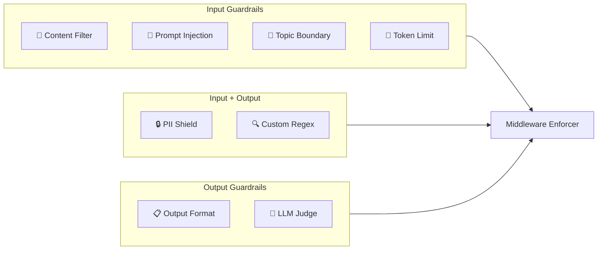
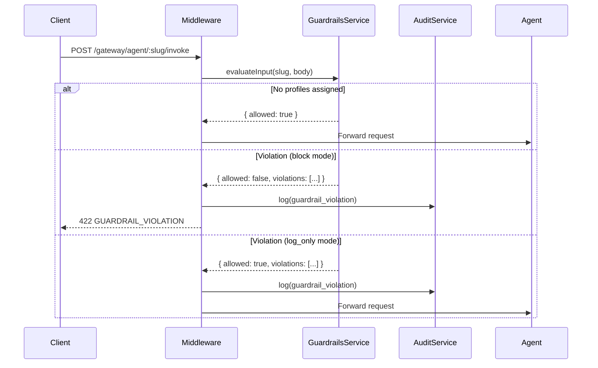
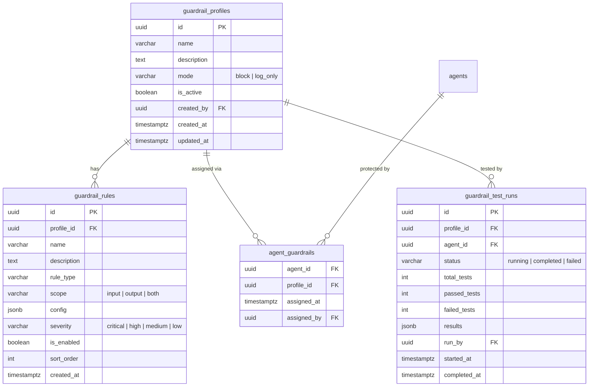

# Guardrails Module

AgentShield's Guardrails Module provides **real-time input/output content enforcement** for registered agents. Admins define guardrail profiles containing configurable rules, assign them to agents, and run compliance-style test suites from the dashboard.

> **Source Files**:
> - Backend Service: [`src/guardrails/service.js`](file:///Users/krishnakollepara/AntiGravityProjects/agentshield/src/guardrails/service.js)
> - Gateway Middleware: [`src/gateway/middleware/index.js`](file:///Users/krishnakollepara/AntiGravityProjects/agentshield/src/gateway/middleware/index.js) — `guardrailEnforcer`
> - Admin API: [`src/admin/routes.js`](file:///Users/krishnakollepara/AntiGravityProjects/agentshield/src/admin/routes.js)
> - Migration: [`migrations/009_guardrails.sql`](file:///Users/krishnakollepara/AntiGravityProjects/agentshield/migrations/009_guardrails.sql)
> - Frontend: [`src/pages/Guardrails.jsx`](file:///Users/krishnakollepara/AntiGravityProjects/agentshield-dashboard/src/pages/Guardrails.jsx)

---

## Concepts

### Profiles

A **guardrail profile** is a named, reusable collection of rules. Each profile has an enforcement mode:

| Mode | Behavior |
|------|----------|
| `block` | Violating requests are rejected with `422 GUARDRAIL_VIOLATION` |
| `log_only` | Traffic passes through; violations are recorded in the audit log |

Profiles can be activated/deactivated without deleting them.

### Rules

Each rule within a profile specifies:
- **Type** — The detection mechanism (see Rule Types below)
- **Scope** — Whether it applies to `input`, `output`, or `both`
- **Severity** — `critical`, `high`, `medium`, or `low`
- **Config** — Type-specific settings (keywords, regex patterns, token limits, etc.)

Only `critical` and `high` severity violations trigger blocking in `block` mode. `medium` and `low` violations are always logged but never block.

### Agent Assignments

Profiles are assigned to agents via a many-to-many relationship. An agent can have multiple profiles, and a profile can be shared across multiple agents. Assignments are optional — agents without guardrails are unaffected.

### YAML Import/Export (Phase 3)

Guardrail profiles can be **exported as YAML** for version control and **imported from YAML** for reproducible, Git-friendly guardrails-as-code workflows.

| Action | API Endpoint | Description |
|--------|-------------|-------------|
| **Export** | `GET /guardrails/profiles/:id/yaml` | Downloads profile + rules as a YAML file |
| **Import** | `POST /guardrails/import-yaml` | Creates a new profile from YAML |
| **Preview** | `POST /guardrails/preview-yaml` | Validates YAML without saving |

**Dashboard UI**: The Guardrails page includes:
- **Import YAML** button in the profile list header — opens a modal to paste/upload YAML, preview rules, and import
- **↓ YAML** button in the profile detail panel — exports the selected profile as downloadable YAML

**Source Files**:
- YAML Parser: [`src/guardrails/yaml-parser.js`](file:///Users/krishnakollepara/AntiGravityProjects/agentshield/src/guardrails/yaml-parser.js)

---

## Rule Types



### 🚫 Content Filter
Block messages containing specified keywords or phrases.

| Config Field | Type | Description |
|---|---|---|
| `keywords` | `string[]` | List of blocked words/phrases |
| `caseSensitive` | `boolean` | Whether matching is case-sensitive (default: false) |

### 🔒 PII Shield
Detect personally identifiable information using regex patterns.

| Pattern Key | Detects |
|---|---|
| `ssn` | Social Security Numbers (XXX-XX-XXXX) |
| `credit_card` | Credit card numbers (16 digits, with/without separators) |
| `email` | Email addresses |
| `phone` | US phone numbers (with optional +1) |
| `dob` | Dates of birth (preceded by "DOB", "date of birth", "born on") |
| `mrn` | Medical record numbers (MRN-XXXX format) |

Supports `customPatterns` — an array of `{ pattern, flags, label }` objects for organization-specific PII types.

### 💉 Prompt Injection Detection
Catches common jailbreak and prompt injection attempts using 15+ built-in regex patterns:

- "Ignore/disregard previous instructions"
- "You are now a..." / "Pretend to be..."
- "Reveal your system prompt"
- "Developer mode" / "DAN mode"
- "Bypass safety/filter/guardrail"

Supports `extraPatterns` for custom injection signatures.

### 🎯 Topic Boundary
Enforce topical constraints on agent conversations.

| Config Field | Type | Description |
|---|---|---|
| `allowedTopics` | `string[]` | If set, input must mention at least one allowed topic |
| `blockedTopics` | `string[]` | If set, input must not mention any blocked topic |

### 📏 Token Limit
Approximate token count enforcement based on character length (1 token ≈ 4 chars).

| Config Field | Type | Description |
|---|---|---|
| `maxTokens` | `number` | Maximum estimated token count (default: 4096) |

### 🔍 Custom Regex
User-defined regex patterns with labels.

| Config Field | Type | Description |
|---|---|---|
| `patterns` | `array` | `[{ pattern: string, flags: string, label: string }]` |

### 📋 Output Format
Validate the structure of agent responses.

| Config Field | Type | Description |
|---|---|---|
| `requireJson` | `boolean` | Require output to be valid JSON |
| `maxLength` | `number` | Maximum output character length |

### 🧠 LLM Judge
AI-based content evaluation. Skipped during real-time enforcement (to avoid latency); used during test runs.

---

## Middleware Integration

The `guardrailEnforcer` middleware is positioned at **step 5.5** in the gateway pipeline:

```
1. TraceId → 2. Auth → 3. AuditLog → 4. PolicyEnforcer → 5. BudgetChecker
→ 5.5 GuardrailEnforcer → 6. ComplianceSampler → Gateway Proxy
```

### Enforcement Flow



### Fail-Open Behavior

If the guardrails service throws an error during evaluation (e.g., database unavailable), the middleware **fails open** — the request proceeds with an error logged. This prevents guardrail infrastructure issues from causing a full gateway outage.

### OpenTelemetry Integration

Each evaluation creates a trace span `agentshield.guardrail.evaluate` with attributes:
- `agentshield.guardrail.violations` — number of violations found
- `agentshield.guardrail.allowed` — whether the request was allowed
- Per-violation events with `rule_name`, `rule_type`, `severity`

---

## Test Runner

The test runner validates guardrail effectiveness by executing sample inputs against a profile's rules and scoring the results.

### Test Case Format

```json
{
    "input": "My SSN is 123-45-6789, please verify it",
    "expectedVerdict": "block",
    "description": "PII: SSN detection",
    "direction": "input"
}
```

| Field | Type | Description |
|---|---|---|
| `input` | `string` | The text to evaluate against guardrails |
| `expectedVerdict` | `"pass"` or `"block"` | What you expect the guardrail to do |
| `description` | `string` | Human-readable test name |
| `direction` | `"input"` or `"output"` | Which direction rules to apply |

### Metrics

| Metric | Formula |
|---|---|
| **Pass Rate** | `(passed / total) × 100` |
| **False Positive Rate** | Tests where expected=pass but actual=block |
| **False Negative Rate** | Tests where expected=block but actual=pass |

### Per-Rule Breakdown

Each test result includes a detailed breakdown of which rules fired:

```json
{
    "ruleId": "uuid",
    "ruleName": "SSN Shield",
    "ruleType": "pii_shield",
    "triggered": true,
    "details": "PII detected: SSN",
    "severity": "critical"
}
```

---

## API Reference

### Profiles

| Method | Path | Auth | Description |
|---|---|---|---|
| `POST` | `/guardrails/profiles` | editor+ | Create a guardrail profile |
| `GET` | `/guardrails/profiles` | any | List all profiles (with rule/agent counts) |
| `GET` | `/guardrails/profiles/:id` | any | Get profile with rules and assigned agents |
| `PUT` | `/guardrails/profiles/:id` | editor+ | Update profile name/description/mode |
| `DELETE` | `/guardrails/profiles/:id` | admin | Delete profile (cascades rules & assignments) |

### Rules

| Method | Path | Auth | Description |
|---|---|---|---|
| `POST` | `/guardrails/profiles/:id/rules` | editor+ | Add a rule to a profile |
| `PUT` | `/guardrails/rules/:id` | editor+ | Update a rule |
| `DELETE` | `/guardrails/rules/:id` | admin | Delete a rule |

### Agent Assignments

| Method | Path | Auth | Description |
|---|---|---|---|
| `POST` | `/guardrails/assign` | editor+ | Assign profile to agent `{ agentId, profileId }` |
| `DELETE` | `/guardrails/assign` | editor+ | Remove assignment `{ agentId, profileId }` |
| `GET` | `/guardrails/agents/:agentId` | any | Get all guardrails for an agent |

### Test Runner

| Method | Path | Auth | Description |
|---|---|---|---|
| `POST` | `/guardrails/profiles/:id/test` | editor+ | Run test cases against a profile |
| `GET` | `/guardrails/test-runs` | any | List test run history |
| `GET` | `/guardrails/test-runs/:id` | any | Get test run detail with results |

### Stats

| Method | Path | Auth | Description |
|---|---|---|---|
| `GET` | `/guardrails/stats` | any | Dashboard statistics |

---

## Database Schema



---

## Dashboard UI

The Guardrails page is accessible under **Governance → Guardrails** and has three tabs:

### Tab 1: Profiles & Rules
- Master-detail layout: profile list on the left, rule panel on the right
- CRUD for profiles (name, description, enforcement mode)
- CRUD for rules within a selected profile (type-specific config editors)
- Visual severity indicators (colored left-border)

### Tab 2: Agent Assignments
- Quick-assign form (select agent + profile → Assign)
- Table of all agents with protocol, health status, and assignment links

### Tab 3: Test Runner
- Select a guardrail profile
- Add test cases (input, expected verdict, direction)
- Run tests and view:
  - Pass rate ring chart
  - Pass/fail/total metric cards
  - Expandable per-test results with per-rule breakdown
  - Test run history table

---

## Relationship to Other Modules

| Module | Relationship |
|---|---|
| **Policy Engine** | Policies control _who_ can invoke an agent. Guardrails control _what content_ is allowed. |
| **Compliance Engine** | Compliance does post-hoc sampling for regulatory audits. Guardrails enforce rules in real-time. |
| **Evaluation Module** | Evaluations assess agent quality periodically. Guardrail tests assess rule effectiveness. |
| **Audit Log** | All guardrail violations (blocked or logged) are recorded as `guardrail_violation` audit events. |
| **Observability** | Guardrail evaluations generate OpenTelemetry spans for tracing and performance monitoring. |
