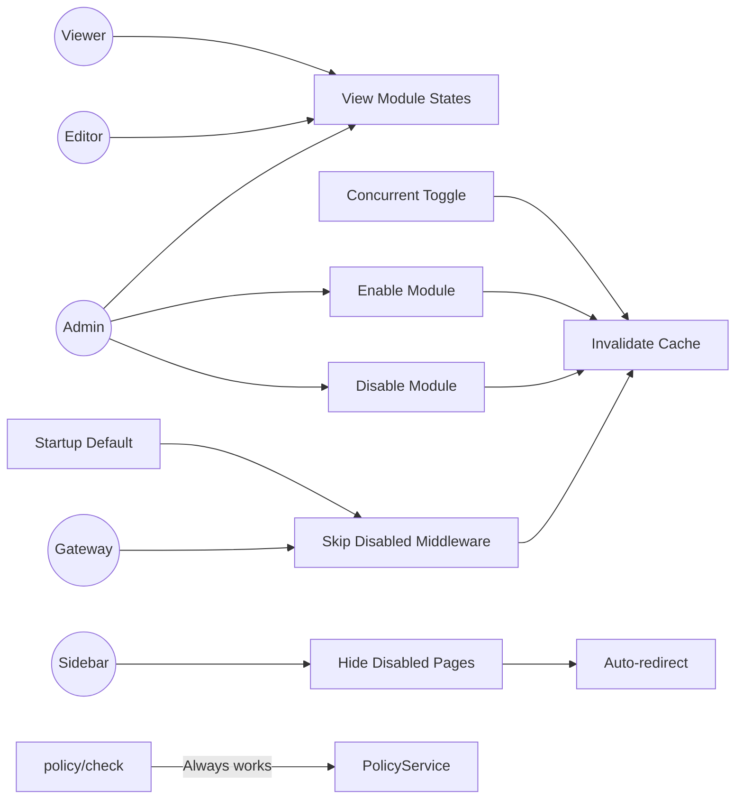

# Module Toggles — Use Cases

AgentShield's Module Toggle System allows administrators to enable or disable governance modules at runtime. This document covers all user-facing and system-level use cases.

> **Source Files**:
> - Backend: [`src/settings/service.js`](file:///Users/krishnakollepara/AntiGravityProjects/agentshield/src/settings/service.js)
> - Middleware: [`src/gateway/middleware/index.js`](file:///Users/krishnakollepara/AntiGravityProjects/agentshield/src/gateway/middleware/index.js)
> - API Routes: [`src/admin/routes.js`](file:///Users/krishnakollepara/AntiGravityProjects/agentshield/src/admin/routes.js)
> - Frontend: [`src/pages/Settings.jsx`](file:///Users/krishnakollepara/AntiGravityProjects/agentshield-dashboard/src/pages/Settings.jsx), [`src/App.jsx`](file:///Users/krishnakollepara/AntiGravityProjects/agentshield-dashboard/src/App.jsx)

---

## Actors

| Actor | Description |
|-------|-------------|
| **Admin** | Can enable/disable any module. Can view all module states. |
| **Editor** | Can view module states. Cannot toggle modules (requires `admin` role). |
| **Viewer** | Can view module states. Read-only access. |
| **Gateway Middleware** | Checks module flags before enforcing policies, guardrails, budgets, and compliance. |
| **SettingsService** | Backend service. Manages the module cache, reads/writes toggle states. |
| **Sidebar (App.jsx)** | Polls module states every 60 seconds and filters navigation items. |

---

## UC-01: View Module States

**Primary Actor**: Admin / Editor / Viewer
**Precondition**: User is authenticated and on the Settings page.

### Flow

1. User navigates to **Settings → Modules** tab (first tab in the tab bar).
2. Frontend calls `GET /settings/modules`.
3. Backend returns all rows from the `settings` table where `category = 'modules'`.
4. Frontend renders five module cards, each showing:
   - Module name, description, and icon
   - `● Enabled` (green badge) or `○ Disabled` (gray badge)
   - Pipeline badge (`Gateway Pipeline` or `On-Demand`)
   - Middleware function name (if applicable)
   - Affected sidebar pages
5. A summary footer shows how many modules are currently disabled (if any).

### Alternative Flows

- **A1 — Fresh installation (no module rows)**: All modules display as enabled (default behavior).
- **A2 — Partial configuration**: Only modules with explicit rows show their stored state. Unconfigured modules default to enabled.

### Postcondition

User has a complete overview of all module states.

---

## UC-02: Disable a Module

**Primary Actor**: Admin
**Precondition**: User has `admin` role. Target module is currently enabled.

### Flow

1. User locates the target module card in the Modules tab.
2. User clicks the **toggle switch** on the card.
3. If the module has `critical` severity (e.g., Policies):
   a. A browser confirmation dialog appears: _"⚠️ WARNING: Disabling this means ALL gateway requests will be allowed without access checks. Are you sure?"_
   b. User confirms.
4. Frontend calls `PUT /settings` with:
   ```json
   { "category": "modules", "key": "guardrails", "value": { "enabled": false } }
   ```
5. Backend upserts the setting row and calls `settingsService.invalidateModuleCache()`.
6. Frontend updates the local state. The card transitions to disabled styling (dimmed, gray badge).
7. If a warning exists for the module, a colored alert appears below the description.

### Alternative Flows

- **A1 — Editor/Viewer attempts toggle**: The `PUT /settings` endpoint requires `admin` role and returns `403 Forbidden`.
- **A2 — Network error during toggle**: An alert is shown. The toggle reverts to its previous state.
- **A3 — Module with `high` severity (Cost Management)**: No confirmation dialog, but an amber warning banner appears after disabling.

### Postcondition

- The module's middleware is bypassed on all subsequent gateway requests (within ~30 seconds or immediately if cache was invalidated).
- The module's sidebar page(s) will disappear from other users' dashboards within 60 seconds (next poll cycle).
- All existing data (rules, profiles, budgets, etc.) is preserved.

---

## UC-03: Enable a Module

**Primary Actor**: Admin
**Precondition**: User has `admin` role. Target module is currently disabled.

### Flow

1. User locates the disabled module card (displayed with reduced opacity and gray badge).
2. User clicks the **toggle switch**.
3. Frontend calls `PUT /settings` with `{ "category": "modules", "key": "<module>", "value": { "enabled": true } }`.
4. Backend upserts the row and invalidates the module cache.
5. Card transitions to enabled styling (full opacity, colored border, green badge).
6. Any warning banner for the module disappears.

### Postcondition

- The module's middleware is active again. All enforcement resumes with full historical data.
- Sidebar pages reappear within 60 seconds.

---

## UC-04: Gateway Request with Disabled Module

**Primary Actor**: Gateway Middleware (automatic)
**Precondition**: A module is disabled via Settings.

### Flow — Example: Guardrails Disabled

1. Client sends `POST /api/v1/gateway/agents/:slug/invoke`.
2. Request enters the middleware chain:
   - `traceId` → assigns trace ID ✓
   - `authenticate` → validates JWT ✓
   - `auditLogger` → attaches audit hook ✓
   - `policyEnforcer` → evaluates policies (if enabled) ✓
   - `budgetChecker` → checks budgets (if enabled) ✓
   - **`guardrailEnforcer`** → calls `getModuleStatus('guardrails')`:
     - Cache returns `{ enabled: false }`.
     - Logs: `"Guardrail enforcement skipped — module disabled"`.
     - Calls `next()` immediately.
   - `complianceSampler` → samples response (if enabled) ✓
3. Request reaches the gateway proxy and is forwarded to the agent (REST or MCP).
4. Agent response is returned to the client.

### Alternative Flows

- **A1 — Multiple modules disabled**: Each middleware independently checks its own module flag. Disabling guardrails does not affect compliance or budgets.
- **A2 — Cache miss**: `getModuleStatus()` refreshes the cache from the DB. If the DB is unavailable, defaults to enabled (fail-open).
- **A3 — Policy module disabled**: **All** access control is bypassed. Any authenticated user can invoke any agent. This is the highest-risk toggle.
- **A4 — MCP agent invocation**: The MCP protocol is unaffected. Only the middleware enforcement layer is bypassed. The MCP SSE connection, tool listing, and tool calling proceed normally.

### Postcondition

Request is processed with the disabled module's enforcement skipped. Audit logging still captures the request.

---

## UC-05: Sidebar Hiding on Module Disable

**Primary Actor**: Dashboard App (automatic)
**Precondition**: A module is disabled. User is viewing the dashboard.

### Flow

1. `App.jsx` fetches `GET /settings/modules` on login and every 60 seconds.
2. The `MODULE_NAV_MAP` maps module keys to sidebar nav keys:
   ```javascript
   { policies: ['policies'], guardrails: ['guardrails'], compliance: ['compliance'],
     cost_management: ['cost'], evaluations: ['evaluations'] }
   ```
3. `NAV_ITEMS` are filtered: items whose module is disabled are excluded.
4. If all items in a nav section are hidden, the entire section header is removed.
5. Sidebar re-renders without the hidden items.

### Alternative Flows

- **A1 — User is on a disabled page**: The auto-redirect `useEffect` detects that `activePage`'s module is disabled and calls `setActivePage('dashboard')`.
- **A2 — Module re-enabled**: The page reappears in the sidebar on the next 60-second poll. Users can navigate to it immediately.
- **A3 — Settings page**: The Settings page is **never hidden** — it's always accessible regardless of module toggles.

### Postcondition

Sidebar reflects only enabled modules. Disabled modules' pages are inaccessible.

---

## UC-06: Cache Invalidation on Toggle

**Primary Actor**: SettingsService (automatic)
**Precondition**: Admin toggles a module via the API.

### Flow

1. `PUT /settings` endpoint receives a request with `category === 'modules'`.
2. Backend upserts the setting row in the `settings` table.
3. Backend calls `settingsService.invalidateModuleCache()`:
   - Sets `_moduleCache = null` and `_moduleCacheExpiry = 0`.
   - Logs: `"Module feature-flag cache invalidated"`.
4. The next gateway request triggers `_refreshModuleCache()`:
   - Queries `SELECT * FROM settings WHERE category = 'modules'`.
   - Rebuilds `_moduleCache` with fresh data.
   - Sets new expiry to `Date.now() + 30000`.

### Alternative Flows

- **A1 — Non-module settings update**: `settingsService.invalidateModuleCache()` is NOT called. Cache remains valid.
- **A2 — DB error during refresh**: Cache is set to empty `{}` (all modules default to enabled) with a 5-second TTL for faster retry.

### Postcondition

Middleware picks up the new module state within milliseconds (not 30 seconds) of a toggle change.

---

## UC-07: Startup Behavior (No Module Settings)

**Primary Actor**: System
**Precondition**: Fresh AgentShield installation. `settings` table has no `category = 'modules'` rows.

### Flow

1. Server starts. SettingsService constructor initializes:
   ```javascript
   this._moduleCache = null;
   this._moduleCacheExpiry = 0;
   ```
2. First gateway request arrives. `getModuleStatus('guardrails')` is called.
3. Cache is null → `_refreshModuleCache()` queries the DB.
4. DB returns 0 rows → `_moduleCache = {}`.
5. `getModuleStatus()` checks: `this._moduleCache['guardrails']` → `undefined`.
6. `undefined?.enabled !== false` → `true` (default: enabled).

### Postcondition

All modules default to enabled on fresh install. No seed data or migration is required.

---

## UC-08: Concurrent Admin Toggle

**Primary Actor**: Two Admin users
**Precondition**: Both admins are on the Settings → Modules tab.

### Flow

1. Admin A disables Guardrails → `PUT /settings { key: 'guardrails', value: { enabled: false } }`.
2. Backend upserts row. Cache invalidated.
3. Admin B's dashboard still shows Guardrails as enabled (stale state, up to 60 seconds old).
4. After ≤60 seconds, Admin B's `App.jsx` polls `GET /settings/modules`.
5. Admin B's UI updates: Guardrails card shows disabled. Guardrails page disappears from sidebar.

### Alternative Flows

- **A1 — Admin B navigates to Modules tab**: `loadTabData()` fetches fresh state from the API, showing the updated toggle immediately.
- **A2 — Admin B toggles Guardrails back on before poll**: Both admins' last-write-wins. The `ON CONFLICT DO UPDATE` SQL ensures no race condition — the latest value is always persisted.

### Postcondition

Both admins eventually see the consistent final state. No data corruption is possible due to upsert semantics.

---

## UC-09: policy/check Endpoint with Policies Disabled

**Primary Actor**: External client using the self-service policy check API
**Precondition**: Policies module is disabled.

### Flow

1. Client calls `POST /api/v1/gateway/policy/check` with `{ agentSlug: 'my-agent' }`.
2. The `policyEnforcer` middleware skips this endpoint by design (it checks `req.path === '/api/v1/gateway/policy/check'` and returns `next()`).
3. The `policy/check` route handler in `proxy.js` calls `policyService.evaluate(context)` **directly** — not through the middleware.
4. The policy engine evaluates normally and returns the decision.

### Postcondition

`policy/check` always works regardless of the Policies module toggle. It's a diagnostic/pre-check tool — disabling the module only disables *enforcement* on live requests, not the ability to *query* policy decisions.

---

## Use Case Diagram


