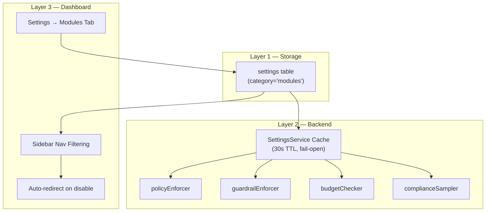

# Module Toggle System

AgentShield's Module Toggle System provides **runtime feature-flag control** over governance modules. Administrators can enable or disable entire feature modules (Guardrails, Compliance, Cost Management, Evaluations, Policies) via the Settings page without restarting the server or losing data.

> **Source Files**:
> - Settings Service: [`src/settings/service.js`](file:///Users/krishnakollepara/AntiGravityProjects/agentshield/src/settings/service.js) — `getModuleStatus()`, cache layer
> - Gateway Middleware: [`src/gateway/middleware/index.js`](file:///Users/krishnakollepara/AntiGravityProjects/agentshield/src/gateway/middleware/index.js) — toggle checks in 4 middleware functions
> - Admin Routes: [`src/admin/routes.js`](file:///Users/krishnakollepara/AntiGravityProjects/agentshield/src/admin/routes.js) — cache invalidation on update
> - Frontend Settings: [`src/pages/Settings.jsx`](file:///Users/krishnakollepara/AntiGravityProjects/agentshield-dashboard/src/pages/Settings.jsx) — Modules tab
> - Frontend App: [`src/App.jsx`](file:///Users/krishnakollepara/AntiGravityProjects/agentshield-dashboard/src/App.jsx) — sidebar visibility filtering

---

## Concepts

### Module

A **module** is a named governance feature area that can be independently enabled or disabled. Each module may have:
- A **middleware function** in the gateway pipeline that enforces rules at request time
- One or more **sidebar pages** in the dashboard
- An **impact severity** indicating the risk of disabling it

### Module States

| State | Behavior |
|-------|----------|
| `enabled` (default) | Module's middleware is active. Sidebar pages are visible. Full enforcement. |
| `disabled` | Module's middleware is bypassed (`next()` called immediately). Sidebar pages hidden. All data preserved. |

All modules default to **enabled** when no explicit setting exists. This ensures a fresh installation has full governance active.

### Toggleable Modules

| Module Key | Display Name | Middleware | Pipeline Stage | Sidebar Pages | Severity |
|-----------|-------------|-----------|---------------|--------------|----------|
| `policies` | Access Policies | `policyEnforcer` | Gateway Pipeline | Policies | **Critical** |
| `guardrails` | Guardrails | `guardrailEnforcer` | Gateway Pipeline | Guardrails | High |
| `compliance` | Compliance | `complianceSampler` | Gateway Pipeline | Compliance | Medium |
| `cost_management` | Cost Management | `budgetChecker` | Gateway Pipeline | Cost Management | High |
| `evaluations` | Evaluations | _(none)_ | On-Demand | Evaluations | Low |

### Non-Toggleable Components

These components **always run** regardless of module toggles:

| Component | Reason |
|-----------|--------|
| `traceId` | Every request needs a trace ID for debugging and audit correlation |
| `authenticate` | JWT/API key validation — without this, nothing is secure |
| `auditLogger` | Immutable audit trail — regulatory compliance requirement |
| `costService.recordUsage()` | Usage recording in `proxy.js` (distinct from budget *enforcement*) |
| Agent Registry & Health Checks | Core agent management is always required |

---

## Architecture

### Three-Layer Design



### Cache Mechanism

The module status cache avoids a database query on **every** gateway request:

| Property | Value |
|----------|-------|
| **TTL** | 30 seconds |
| **Invalidation** | Immediate on `PUT /settings` when `category === 'modules'` |
| **Fail behavior** | Fail-open — if DB query fails, all modules default to enabled |
| **Error retry** | On cache refresh error, TTL is reduced to 5 seconds for faster recovery |

```javascript
// Cache structure (in-memory on SettingsService instance)
_moduleCache = {
    policies:        { enabled: true },
    guardrails:      { enabled: false },
    compliance:      { enabled: true },
    cost_management: { enabled: true },
    evaluations:     { enabled: true },
};
_moduleCacheExpiry = Date.now() + 30000; // 30s TTL
```

---

## Middleware Integration

### Position in the Gateway Pipeline

```
1. TraceId → 2. Auth → 3. AuditLog → 4. PolicyEnforcer* → 5. BudgetChecker*
→ 5.5 GuardrailEnforcer* → 6. ComplianceSampler* → Gateway Proxy
```

\* = Toggleable via module flags

### Toggle Check Pattern

Each middleware uses a wrapper function that checks the module flag before delegating to the core logic:

```javascript
function guardrailEnforcer(req, res, next) {
    // Path check (unchanged)
    if (!req.path.startsWith('/api/v1/gateway/') || ...) return next();

    // Module toggle check — NEW
    settingsService.getModuleStatus('guardrails').then(enabled => {
        if (!enabled) {
            logger.debug('Guardrail enforcement skipped — module disabled');
            return next();
        }
        _guardrailEnforcerCore(req, res, next);
    }).catch(() => next()); // Fail-open
}

function _guardrailEnforcerCore(req, res, next) {
    // ... original middleware logic (unchanged) ...
}
```

### Fail-Open Guarantee

If `getModuleStatus()` throws (DB unavailable, cache corruption), the `.catch(() => next())` ensures the request **always proceeds**. The module toggle system is designed to never become a single point of failure.

---

## MCP Impact

The MCP-to-HTTP bridge (`mcp-client.js`) sits **downstream** of the middleware chain. Module toggles affect what happens **before** the MCP invocation, not the MCP protocol itself.

| Module Disabled | Effect on MCP Requests |
|----------------|----------------------|
| **Policies** | MCP invocations bypass access control. Any authenticated user can call any MCP agent. |
| **Guardrails** | Prompts skip PII/toxicity/injection checks before reaching MCP tools. |
| **Cost Management** | MCP calls bypass budget limits. Usage *recording* still happens (it's in `proxy.js`, not the middleware). |
| **Compliance** | MCP responses skip compliance sampling. No samples stored for regulatory reporting. |
| **Evaluations** | **Zero impact** — evaluations run on-demand, not in the pipeline. |

### Cost Recording vs. Cost Enforcement

This is a critical distinction:

| Component | Location | Toggleable? | Function |
|-----------|----------|-------------|----------|
| `budgetChecker` | Middleware | ✅ Yes | "Can this user afford this call?" |
| `costService.recordUsage()` | `proxy.js` | ❌ No | "Log that this call happened" |

Even with Cost Management disabled, the `cost_records` table continues to accumulate usage data. Re-enabling the module immediately restores budget enforcement with full historical context.

---

## API Reference

Module toggles use the **existing** Settings API — no new endpoints were added.

### Read Module States

| Method | Path | Auth | Description |
|--------|------|------|-------------|
| `GET` | `/settings/modules` | any | Returns all module toggle settings |

**Response:**
```json
{
    "success": true,
    "data": [
        { "id": "uuid", "category": "modules", "key": "guardrails", "value": { "enabled": false } },
        { "id": "uuid", "category": "modules", "key": "policies", "value": { "enabled": true } }
    ]
}
```

Modules not present in the response **default to enabled**.

### Update Module State

| Method | Path | Auth | Description |
|--------|------|------|-------------|
| `PUT` | `/settings` | admin | Create or update a module toggle |

**Request:**
```json
{
    "category": "modules",
    "key": "guardrails",
    "value": { "enabled": false },
    "description": "Guardrails module toggle"
}
```

**Side Effects:**
- The module cache is **immediately invalidated** via `settingsService.invalidateModuleCache()`
- The middleware reads the new state on the next gateway request (no server restart)

---

## Database Schema

Module toggles are stored in the existing `settings` table:

```sql
-- No new tables or migrations required
-- Module toggles use the existing settings table

SELECT * FROM settings WHERE category = 'modules';

-- Example rows:
-- | id   | category | key             | value                | description                    |
-- | uuid | modules  | guardrails      | {"enabled": false}   | Guardrails module toggle       |
-- | uuid | modules  | cost_management | {"enabled": true}    | Cost Management module toggle  |
-- | uuid | modules  | policies        | {"enabled": true}    | Access Policies module toggle  |
```

The `settings` table schema:

| Column | Type | Description |
|--------|------|-------------|
| `id` | `UUID` | Primary key |
| `category` | `VARCHAR(50)` | Always `'modules'` for toggles |
| `key` | `VARCHAR(255)` | Module key (e.g., `'guardrails'`) |
| `value` | `JSONB` | `{ "enabled": true/false }` |
| `description` | `TEXT` | Human-readable label |
| `created_at` | `TIMESTAMPTZ` | Row creation time |
| `updated_at` | `TIMESTAMPTZ` | Last modification time |

**Constraint:** `UNIQUE (category, key)` — ensures one toggle per module via `ON CONFLICT ... DO UPDATE`.

---

## Dashboard UI

### Settings → Modules Tab

The Modules tab is the **first tab** in the Settings page. It displays five module cards:

### Card Layout

Each module card shows:

| Element | Description |
|---------|-------------|
| **Icon** | Module-specific emoji icon with severity-colored background |
| **Name** | Bold module name (e.g., "Access Policies") |
| **Status Badge** | Green `● Enabled` or gray `○ Disabled` |
| **Pipeline Badge** | Blue `Gateway Pipeline` or gray `On-Demand` |
| **Description** | One-paragraph explanation of the module's purpose |
| **Middleware** | Code-formatted middleware function name (if applicable) |
| **Pages** | Sidebar pages that will be hidden when disabled |
| **Warning** | Red/amber alert shown when a critical/high module is disabled |
| **Toggle Switch** | Animated switch with async persist to backend |

### Severity-Based Styling

| Severity | Border Color | Warning Behavior |
|----------|-------------|------------------|
| Critical | Red (`#ef4444`) | Confirm dialog before disabling + red warning banner when off |
| High | Amber (`#f59e0b`) | Amber warning banner when off |
| Medium | Indigo (`#6366f1`) | No warning |
| Low | Green (`#10b981`) | No warning |

### Summary Footer

When one or more modules are disabled, a yellow summary bar appears:

> ⚠️ **2 modules** currently disabled. Disabled modules are bypassed in the gateway pipeline and hidden from the sidebar.

### Sidebar Visibility

The sidebar in `App.jsx` automatically filters navigation items:

| Module Disabled | Sidebar Items Hidden |
|----------------|---------------------|
| `policies` | Policies |
| `guardrails` | Guardrails |
| `compliance` | Compliance |
| `cost_management` | Cost Management |
| `evaluations` | Evaluations |

If all items in a nav section are hidden, the entire section header is removed.

### Auto-Redirect

If the user is currently viewing a page whose module becomes disabled, they are automatically redirected to the Dashboard page.

### Polling

Module states are fetched on login and refreshed every 60 seconds to reflect changes made by other admins.

---

## Relationship to Other Modules

| Module | Relationship |
|--------|-------------|
| **Audit Log** | Audit logging is **not toggleable** — it always runs. Module toggle changes are themselves audit-logged. |
| **Agent Registry** | Agent registration is **not toggleable** — always active. Agents continue to exist when their guardrails or policies are disabled. |
| **Observability** | OpenTelemetry tracing is always active. When a middleware is skipped due to module toggle, no span is created for that middleware. |
| **Integrations** | API endpoints for disabled modules still exist but their middleware enforcement is bypassed. The `policy/check` endpoint still evaluates policies even when the Policies module is disabled (it calls the service directly). |
| **Settings** | Module toggles are stored in the same `settings` table as LLM connections and evaluation config. The Settings page is **never hidden** — it's always accessible. |
